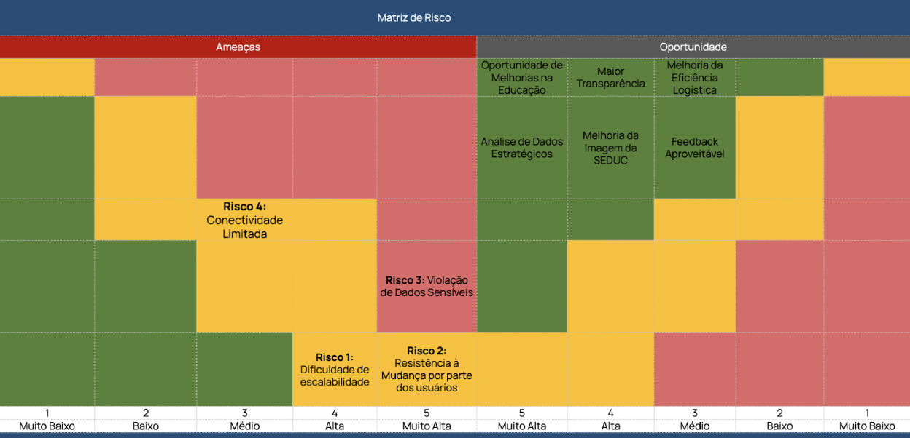
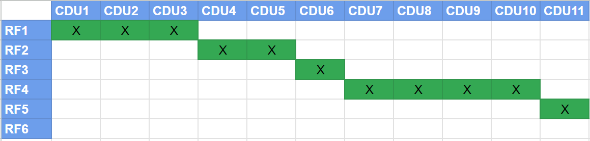
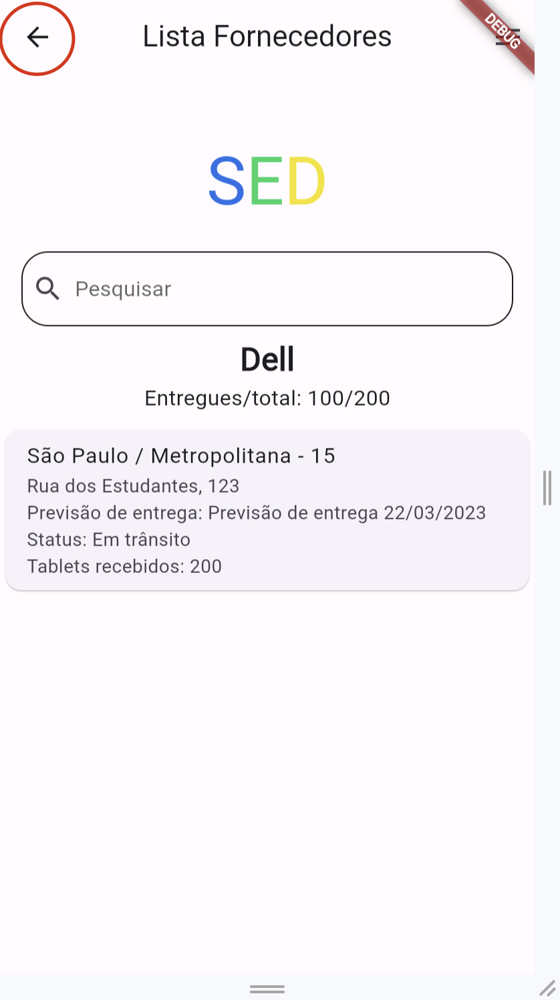
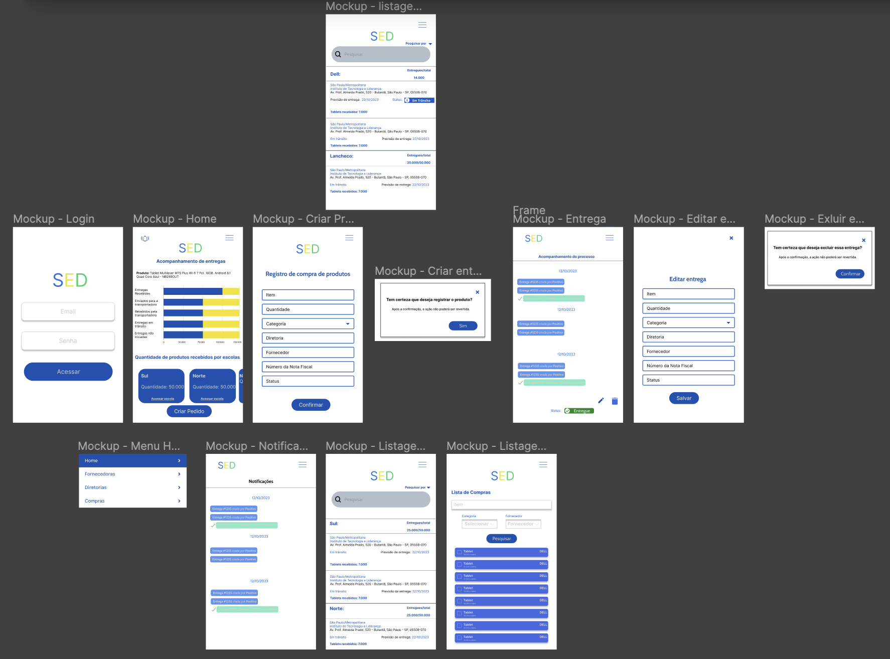
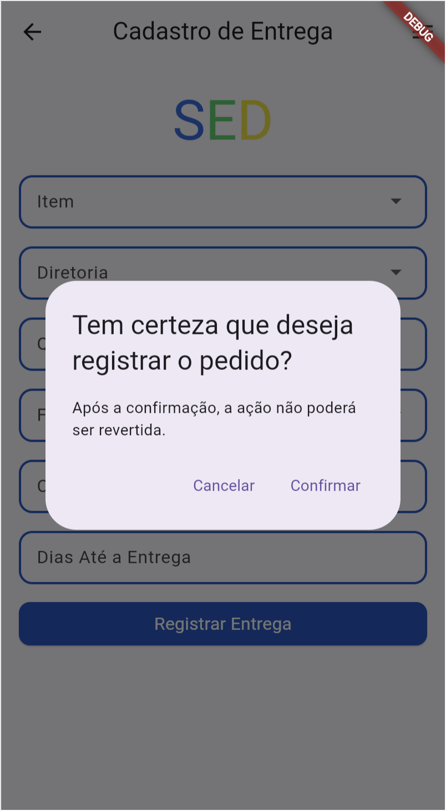

<table>
<tr>
<Table>
  <tr>
    <td><a href= "https://www.educacao.sp.gov.br/"></td>
    <td>
      <a href= "https://www.inteli.edu.br/"></a>
    </td>
  </tr>
</table>


# Nome do Projeto: SED

## Nome do Grupo: Seis é demais

## student: Integrantes:

- <a href="https://www.linkedin.com/in/brunomleao/">Bruno Leão</a>
- <a href="https://www.linkedin.com/in/eduarda-gonzaga-009794219/">Eduarda Gonzaga</a>
- <a href="https://www.linkedin.com/in/joao-victor-montagna-4bb3a4247/">João Victor Montagna</a>
- <a href="https://www.linkedin.com/in/marcelo-saadi-pessini-003212209/">Marcelo Saadi Pessini</a>
- <a href="https://www.linkedin.com/in/rafael-techio/">Rafael Mateus Zimmer Techio</a>
- <a href="https://www.linkedin.com/in/renan-ribeiro-31a205247/">Renan Ribeiro</a>

## Conteúdo

- [Nome do Projeto: SED](#nome-do-projeto-sed)
  - [Nome do Grupo: Seis é demais](#nome-do-grupo-seis-é-demais)
  - [student: Integrantes:](#student-integrantes)
  - [Conteúdo](#conteúdo)
- [Visão Geral do Projeto](#visão-geral-do-projeto)
  - [Parceiro de Negócios](#parceiro-de-negócios)
  - [Análise da Indústria](#análise-da-indústria)
  - [Problema](#problema)
    - [Análise do Problema](#análise-do-problema)
    - [Personas](#personas)
    - [Matriz SWOT](#matriz-swot)
    - [Matriz de Risco](#matriz-de-risco)
    - [Análise Financeira do Projeto](#análise-financeira-do-projeto)
  - [Proposta de Solução](#proposta-de-solução)
    - [Descritivo da Solução](#descritivo-da-solução)
    - [Objetivos](#objetivos)
    - [Proposta de Valor - Value Proposition Canvas](#proposta-de-valor---value-proposition-canvas)
    - [Matriz de avaliação de valor Oceano Azul](#matriz-de-avaliação-de-valor-oceano-azul)
  - [Partes Interessadas](#partes-interessadas)
- [Requisitos](#requisitos)
  - [Mapeamento do processo em alto nível](#mapeamento-do-processo-em-alto-nível)
  - [Requisitos Funcionais](#requisitos-funcionais)
  - [Requisitos não Funcionais](#requisitos-não-funcionais)
  - [Perfis de Usuários](#perfis-de-usuários)
  - [Casos de Uso](#casos-de-uso)
  - [Requisito Funcional 1: Gerenciamento de Usuários Fornecedores](#requisito-funcional-1-gerenciamento-de-usuários-fornecedores)
    - [Caso de Uso 1: Criação de Fornecedores](#caso-de-uso-1-criação-de-fornecedores)
    - [Caso de Uso 2: Edição de Fornecedores](#caso-de-uso-2-edição-de-fornecedores)
    - [Caso de Uso 3: Autenticação de Usuários Fornecedores](#caso-de-uso-3-autenticação-de-usuários-fornecedores)
  - [Requisito Funcional 2: Gerenciamento de Usuários Escolas](#requisito-funcional-2-gerenciamento-de-usuários-escolas)
    - [Caso de Uso 4: Autenticação de Usuários Escolas](#caso-de-uso-4-autenticação-de-usuários-escolas)
  - [Requisito Funcional 3: Gerenciamento de Usuários Administradores](#requisito-funcional-3-gerenciamento-de-usuários-administradores)
    - [Caso de Uso 6: Autenticação de Usuários Administradores](#caso-de-uso-6-autenticação-de-usuários-administradores)
  - [Requisito Funcional 4: Gerenciamento de Entregas](#requisito-funcional-4-gerenciamento-de-entregas)
    - [Caso de Uso 7: Gerenciamento de Status de Entregas](#caso-de-uso-7-gerenciamento-de-status-de-entregas)
    - [Caso de Uso 8: Criação de Entregas](#caso-de-uso-8-criação-de-entregas)
    - [Caso de Uso 9: Edição de Entregas](#caso-de-uso-9-edição-de-entregas)
    - [Caso de Uso 10: Exclusão de Entregas](#caso-de-uso-10-exclusão-de-entregas)
  - [Requisito Funcional 5: Sistema de Classificação e Avaliação](#requisito-funcional-5-sistema-de-classificação-e-avaliação)
    - [Caso de Uso 11: Recomendação de Fornecedores e Transportadoras](#caso-de-uso-11-recomendação-de-fornecedores-e-transportadoras)
- [Arquitetura do Sistema](#arquitetura-do-sistema)
  - [Arquitetura SOA](#arquitetura-soa)
    - [Diagrama de Componentes](#diagrama-de-componentes)
  - [Instrumentos de Arquitetura SOA](#instrumentos-de-arquitetura-soa)
- [Interface](#interface)
  - [Wireframes](#wireframes)
    - [SEDUC](#seduc)
      - [Login](#login)
      - [Home](#home)
      - [Criação de Compra](#criação-de-compra)
      - [Tela de Entrega](#tela-de-entrega)
      - [Notificações](#notificações)
      - [Entregas por Fornecedoras](#entregas-por-fornecedoras)
      - [Entregas por Diretorias](#entregas-por-diretorias)
    - [Fornecedora](#fornecedora)
      - [Login](#login-1)
      - [Home](#home-1)
      - [Criação de Entrega](#criação-de-entrega)
      - [Entrega](#entrega)
      - [Notificações](#notificações-1)
      - [Entregas por Transportadoras](#entregas-por-transportadoras)
      - [Entregas por Diretorias](#entregas-por-diretorias-1)
    - [Transportadora](#transportadora)
      - [Entrega](#entrega-1)
    - [Escola](#escola)
      - [Login](#login-2)
      - [Home](#home-2)
      - [Entrega](#entrega-2)
      - [Notificações](#notificações-2)
  - [Mockup Navegável](#mockup-navegável)
  - [Design de Interface - Guia de Estilos](#design-de-interface---guia-de-estilos)
  - [Análise de Usabilidade](#análise-de-usabilidade)
    - [Utilização do Design System](#utilização-do-design-system)
    - [Heurísticas de Nielsen](#heurísticas-de-nielsen)
      - [- Controle e Liberdade do Usuário](#--controle-e-liberdade-do-usuário)
      - [- Consistência e Padrões](#--consistência-e-padrões)
      - [- Prevenção de Erros](#--prevenção-de-erros)
    - [Zona do Polegar](#zona-do-polegar)
    - [Acessibilidade](#acessibilidade)
      - [Daltonismo](#daltonismo)
- [Projeto de Banco de Dados](#projeto-de-banco-de-dados)
  - [Especificação para recomendação (csv)](#especificação-para-recomendação-csv)
  - [Modelo Conceitual](#modelo-conceitual)
  - [Modelo Lógico](#modelo-lógico)
- [Projeto de Construção da API](#projeto-de-construção-da-api)
  - [Modelo de Recomendação Baseado em Filtragem Colaborativa](#modelo-de-recomendação-baseado-em-filtragem-colaborativa)
  - [Arquitetura de Integração (Diagramas UML)](#arquitetura-de-integração-diagramas-uml)
    - [Diagrama de Classes](#diagrama-de-classes)
      - [Entidades](#entidades)
      - [Camadas](#camadas)
        - [Routers](#routers)
        - [Controllers](#controllers)
        - [Services](#services)
        - [Repositories](#repositories)
        - [Outros](#outros)
    - [Padronizações da API](#padronizações-da-api)
      - [Nome dos arquivos](#nome-dos-arquivos)
      - [Camadas](#camadas-1)
      - [Orientação a Objetos](#orientação-a-objetos)
      - [Nomenclatura de código](#nomenclatura-de-código)
      - [Identação](#identação)
  - [Documentação da API (Swagger)](#documentação-da-api-swagger)
- [Testes de Software](#testes-de-software)
  - [Teste Unitário](#teste-unitário)
  - [Teste de Integração](#teste-de-integração)
  - [Teste de Regressão](#teste-de-regressão)
  - [Teste de Usabilidade](#teste-de-usabilidade)
    - [Justificativas e propósitos dos testes](#justificativas-e-propósitos-dos-testes)
    - [Participantes](#participantes)
    - [Roteiro](#roteiro)
      - [Fluxo SEDUC](#fluxo-seduc)
      - [Fluxo Fornecedora](#fluxo-fornecedora)
      - [Fluxo Transportadora](#fluxo-transportadora)
      - [Fluxo Escola](#fluxo-escola)
    - [Como serão realizados os testes](#como-serão-realizados-os-testes)
    - [Quais podem ser fragilidades e vieses dos testes](#quais-podem-ser-fragilidades-e-vieses-dos-testes)
    - [Dados Coletados](#dados-coletados)
    - [Aplicação do Teste](#aplicação-do-teste)
      - [Fluxo SEDUC](#fluxo-seduc-1)
      - [Fluxo Fornecedora](#fluxo-fornecedora-1)
      - [Fluxo Transportadora](#fluxo-transportadora-1)
      - [Fluxo Escola](#fluxo-escola-1)
      - [Aplicação do SUS](#aplicação-do-sus)
      - [Pontos de melhoria](#pontos-de-melhoria)
        - [Melhorar a clareza na Visualização de Status de Entregas](#melhorar-a-clareza-na-visualização-de-status-de-entregas)
        - [Navegação](#navegação)
        - [Visual](#visual)
        - [Filtros e Busca](#filtros-e-busca)
        - [Personalização por Segmento](#personalização-por-segmento)
        - [Funcionalidade](#funcionalidade)
      - [Conclusão](#conclusão)
  - [Teste de Funcionalidade](#teste-de-funcionalidade)
  - [Teste de API](#teste-de-api)
- [Manual do Usuário](#manual-do-usuário)
- [Referências](#referências)
- [Apêndice](#apêndice)


# Visão Geral do Projeto
Nesse capítulo serão abordadas contextualizações sobre o parceiro, problemática e desafios apresentados e proposta de solução.

## Parceiro de Negócios

A SEDUC, Secretaria de Educação do Estado de São Paulo, é uma instituição governamental de grande porte que atua no direcionamento, gestão e coordenação das políticas públicas de educação no estado de São Paulo. Sua área de atuação na educação pública abrange desde o ensino fundamental até o ensino médio. A SEDUC é uma instituição de extrema relevância no cenário educacional paulista, sendo responsável por administrar e direcionar itens de infraestrutura para as escolas. No cenário educacional, a SEDUC ocupa uma posição de suma importância, desempenhando um papel fundamental no desenvolvimento e aprimoramento do sistema educacional do estado de São Paulo. Como uma entidade governamental, sua missão principal é garantir a oferta de uma educação de qualidade para os cidadãos do estado e promover o acesso à educação.

## Análise da Indústria

Para realizar uma análise de indústria do setor em que a SEDUC está inserida, precisamos relevar alguns pontos antecipadamente:

1. **Dimensão do Setor Público**: A gestão escolar no âmbito público, representada pela SEDUC, é uma parte vital do setor de educação, considerando que a magnitude do sistema de ensino do estado de São Paulo abrange mais de 5 mil escolas entre anos iniciais ao ensino médio, e é responsável pela oferta de educação para aproximadamente 3.5 milhões de estudantes, relevando isso, a SEDUC é uma instituição de grande porte e complexidade. 
2. **Desafios Orçamentários**: Essa indústria muitas vezes enfrenta desafios orçamentários, pois depende principalmente de financiamento público. O orçamento destinado à educação pode variar ao longo dos anos, o que pode afetar a capacidade da SEDUC de implementar programas educacionais eficazes e distribuir itens essenciais.
3. **Complexidade Operacional**: A SEDUC precisa lidar com a complexidade operacional de gerenciar uma rede extensa de escolas, professores, alunos e fornecedores. Isso envolve o recrutamento e treinamento de professores, manutenção de infraestrutura escolar, distribuição de materiais didáticos, avaliação contínua do desempenho escolar e reconhecimento dos melhores fornecedores.

## Problema
Nessa seção serão abordados os desafios apresentados pelo parceiro e suas características.

### Análise do Problema
O problema apresentado pelo parceiro está na dificuldade de gerir os dados gerados pelo processo de entregas de equipamentos para as escolas pela SEDUC. Nesse contexto, diversas dores foram identificadas como:

1. acompanhar o andamento das entregas
2. verificar se os equipamentos realmente chegaram nas escolas
3. receber feedbacks sobre as entregas e qualidade dos itens recebidos
4. assegurar que as escolas tenham acesso a data prevista de recebimento

### Personas
Realizamos a criação de 4 personas e user stories, que representam as principais pessoas envolvidas com o nosso problema. Isso nos ajudará a mapear de maneira eficaz os perfis dos usuários que irão interagir com o nosso sistema.

**Representante do governo (SEDUC):**

O governo desempenha um papel central no processo devido a distribuição de verbas. É responsável por alocar os recursos financeiros necessários para garantir que as escolas recebam os materiais e suprimentos essenciais. Para assegurar a transparência e a eficiência dos gastos públicos, o governo recebe comprovantes detalhados de todas as despesas relacionadas à logística. Além disso, o governo é encarregado de comprovar o uso apropriado desses fundos, garantindo que os recursos sejam utilizados em benefício das escolas. Também desempenha um papel importante na contratação de serviços de logística que garantam a entrega eficiente dos materiais educacionais.


**User story:**

- Eu, como representante do governo, espero que a solução me permita ter uma maior transparência sobre como ocorre todo o processo de contratação de fornecedores. Isso me permitirá justificar os gastos públicos de forma mais coesa e corrigir eventuais obstáculos.

- Eu, como representante do governo, espero ter acesso aos feedbacks fornecidos por gestores de escolas, pois isso me permitirá cobrar melhorias na qualidade dos materiais e corrigir quaisquer erros que possam ocorrer, contribuindo para aprimorar a qualidade do ensino.

- Eu, como representante do governo, desejo ter acesso às datas de entrega dos materiais e às escolas para as quais esses materiais serão destinados. Isso me permitirá tomar medidas corretivas caso haja desvios em relação ao planejado, possibilitando que eu cobre os responsáveis.

- Eu, como representante do governo, espero ter acesso ao status contendo as informações sobre as entregas que estão em andamento. Isso me permitirá monitorar de perto todo o processo de forma mais eficaz.

**Gestora escolar:**

As escolas desempenham um papel vital na recepção e distribuição dos materiais educacionais. Elas recebem as entregas feitas pelas transportadoras, que contêm os materiais necessários para a educação dos alunos e outros. As escolas distribuem os materiais aos alunos e utilizam-nos para suas próprias operações. Além disso, as escolas têm a responsabilidade de informar o recebimento dos materiais, garantindo que o processo de distribuição seja transparente e eficiente.


**User story:**

- Eu, como gestora escolar, é importante para mim que a solução me permita conhecer a data de entrega prevista e acompanhar o status das entregas dos materiais, porquê dessa forma posso me preparar adequadamente para o recebimento.

- Eu, como gestora escolar, desejo ter a capacidade de fornecer feedbacks tanto sobre a qualidade dos materiais fornecidos quanto sobre os serviços prestados, porquê isso contribuirá para a contínua melhoria da qualidade dos produtos e serviços oferecidos. Além disso, poderei informar aos responsáveis sobre o andamento do processo.

- Eu, como gestora escolar, quero que o aplicativo me permita confirmar o recebimento dos materiais, assim, a SEDUC e a fornecedora ficam cientes do recebimento.


**Responsável pela logistica (transportadora):**

A transportadora é responsável por receber os produtos da fornecedora e assume a responsabilidade de gerenciar o processo de logística, levando os itens adquiridos para as escolas de São Paulo.


**User story:**

- Eu, como responsável pela logística, espero que a solução permita acesso a todos os fornecedores que estão trabalhando comigo, pois desejo acompanhar de perto todo o processo.

- Eu, como responsável pela logística, espero que a solução me permita acessar todos os feedbacks fornecidos pelos gestores escolares, porque isso me possibilitará cobrar melhorias quando necessário.

- Eu, como responsável pela logística, espero que o sistema me permita estabelecer contato direto com fornecedores e escolas, uma vez que isso me permitirá efetuar cobranças diretas, sem a necessidade de espera, quando for necessário.

- Eu, como responsável pela logística, espero que a solução me forneça acesso a definição de datas de entrega, aos materiais que serão entregues e às escolas que receberão esses materiais, pois isso me dará a certeza de como todo o processo está ocorrendo.

- Eu, como responsável pela logística, espero que o sistema me permita ter acesso ao status de entrega, pois assim, posso acompanhar este processo.


**Fornecedor:**

O fornecedor desempenha um papel crucial na operação de logística para as escolas. Ele recebe a verba do logista é responsável por adquirir os materiais e suprimentos necessários de acordo com as especificações exigidas. Além disso, os fornecedores realizam o preparo dos materiais e suprimentos antes da entrega. Para garantir a transparência e a prestação de contas, os fornecedores comprovam os gastos relacionados à aquisição e preparo dos materiais para o logista. Também é responsabilidade dos fornecedores contratar transportadoras confiáveis para garantir a entrega eficiente dos materiais nas escolas.


**User story:**

- Eu, como fornecedor, espero uma solução que me permita ter acesso aos feedbacks fornecidos à minha empresa, pois assim poderei aprimorar a qualidade dos meus serviços e materiais.

- Eu, como fornecedor, espero que a solução me permita entrar em contato com o responsável pela logística, caso seja necessário. Isso possibilitará solucionar possíveis erros, caso ocorra. 

- Eu, como fornecedor, espero que a solução me permita comprovar que os produtos foram entregues para as escolas, conforme o acordado. Isso aumentará a minha confiança em relação à validação das minhas responsabilidades.

### Matriz SWOT
Afim de entender melhor o contexto em que a solução apresentará em relação ao parceiro, foi desenvolvida a matriz SWOT a seguir:


### Matriz de Risco
A gestão de riscos desempenha um papel fundamental em qualquer organização, ajudando a identificar, avaliar e mitigar ameaças potenciais que podem impactar seus objetivos e operações. Uma ferramenta essencial nesse processo é a Matriz de Risco. Esta documentação visa fornecer uma compreensão abrangente da Matriz de Risco, explicando sua importância, os princípios subjacentes e como ela pode ser aplicada de forma eficaz para tomar decisões informadas e proativas. A seguir, a matriz de risco desenvolvida:



**Oportunidades**:
- Melhoria da Eficiência Logística: A implementação bem-sucedida do aplicativo pode levar a uma melhoria significativa na eficiência das entregas, reduzindo custos e aprimorando a qualidade do serviço.
- Feedback Aproveitável: A coleta de feedback dos gestores escolares pode fornecer insights valiosos para aprimorar o processo de entrega e identificar oportunidades de inovação.
- Melhoria da Imagem: O aplicativo pode ajudar a SEDUC a melhorar sua imagem perante as escolas e os fornecedores, demonstrando compromisso com a transparência e a qualidade dos serviços.
- Análise de Dados Estratégicos: Com a coleta de dados sobre entregas e avaliações de fornecedores, a SEDUC pode realizar análises estratégicas para otimizar o processo de compras e fornecimento de materiais e suprimentos.
- Maior Transparência: O aplicativo pode aumentar a transparência no sistema de entregas, permitindo que gestores e stakeholders acompanhem o status em tempo real.
- Oportunidade de Melhorias na Educação: Uma entrega eficaz e pontual de materiais e suprimentos pode melhorar a qualidade da educação nas escolas estaduais, resultando em benefícios de longo prazo para os estudantes e a comunidade.

Para garantir o sucesso de um projeto, é importante identificar e mitigar todos os riscos envolvidos no processo. No caso do projeto em questão, foram identificados alguns riscos. Abaixo, apresentamos maneiras de mitigar riscos mapeados:

**Riscos**:
- Risco 1: Realizar avaliações regulares de capacidade e desempenho do sistema à medida que o número de escolas atendidas aumenta. Isso inclui otimizações de código, escalonamento da infraestrutura de servidores e uso de tecnologias de computação em nuvem escalável.

- Risco 2: Implementar um programa abrangente de treinamento e capacitação para gestores escolares e fornecedores. Isso inclui sessões de treinamento presenciais e online, tutoriais, guias de uso e suporte técnico dedicado para responder a dúvidas e problemas.

- Risco 3: Implementar medidas de segurança robustas, como criptografia de dados, autenticação e acesso baseado em papéis.

- Risco 4: Desenvolver uma funcionalidade de armazenamento local para permitir o uso do aplicativo em modo offline. Isso permite que os dados sejam coletados localmente e posteriormente sincronizados quando houver conexão com a internet.

### Análise Financeira do Projeto
A análise financeira desse projeto baseia-se em dois pilares: os **custos estimados** da implantação e manutenção do projeto durante o período de um ano e a **disponibilidade** de recursos por parte do parceiro.

Dessa forma, os seguintes custos foram estimados:

| Nome            | Descrição                                                                                                                                                                                                     | Valor                                                          | Período |
| --------------- | ------------------------------------------------------------------------------------------------------------------------------------------------------------------------------------------------------------- | -------------------------------------------------------------- | ------- |
| Equipe          | Pessoas que irão realizar a manutenção e escalar o aplicativo. Foram estimados, entre juniors e plenos, três profissionais sendo, **desenvolvedor backend**, **desenvolvedor mobile** e **analista de dados** | **R$ 12.000** (todos juniors) até **R$ 28.000** (todos plenos) | mês     |
| Infraestrutura  | Estrutura de servidores que irão sustentar o funcionamento completo da aplicação, sendo esses estimados usando os serviços da cloud **aws**, sendo: 2 **EC2** t2.micro e um **RDS**                           | **R$ 1213,71**                                                 | mês     |
| Licença Apple   | Upgrade necessário de uma conta para empresas na apple store. Necessário para disponibilizar o aplicativo para usuários de Iphone por meio da loja padrão                                                     | **R$ 125**                                                     | mês     |
| Licença Android | Upgrade necessário de uma conta de desenvolvedor na play store. Necessário para disponibilizar o aplicativo para usuários de Android por meio da loja padrão                                                  | **R$ 100**                                                     | uma vez |

Assim, o gasto estimado total, em um período de um ano, seria entre **R$ 160.164,52** ~ **R$ 352.064,52** sendo o fator variante a composição da equipe de manutenção. Vale ressaltar que pode-se contratar uma pessoa que trabalha em todas essas áreas e/ou barganhar salário.

Os custos mensais foram apresentados ao parceiro na primeira sprint e não houveram ponderações, portanto, entende-se que o projeto se enquadra nos gastos projetados pelo parceiro. Como o parceiro é um órgão público, há a disponibilidade de verbas e fundos para a implantação de projetos tecnologicos e órgãos com equipes de desenvolvimento já constituídas capazes de realizar a manutenção de projetos como esse.

Um motivador da implementação dessa solução, ainda que não gere receita, é a **redução de custos** nas licitações milionárias por meio de uma melhor escolha de fornecedoras, diminuição de golpes e agilidade em lidar com possíveis problemas através do modelo de recomendação e bom uso da governança de dados do processo de distribuição de equipamentos que o app SED oferece.

## Proposta de Solução
Nessa seção, serão abordados conceitos sobre a solução proposta para a resolução das problemáticas analisadas.

### Descritivo da Solução
A solução proposta deve assegurar a governança de dados no processo de entrega. Para tal, as personas identificadas terão acesso a um aplicativo mobile que abordará todos os processos necessários dentro de suas necessidades para completar o ciclo de entrega. Os aplicativos irão comunicar-se com uma API em nuvem que irá registrar os dados em um banco de dados e trocar informações com o modelo de recomendação e possíveis APIs do governo.

### Objetivos
O projeto tem por objetivo gerar governança de dados no processo de entrega de equipamentos para escolas pela SEDUC por meio de uma série de aplicativos e APIs. Dessa forma, reduziremos custos de aquisições de novos equipamentos e por consequência, novas iniciativas poderão ser implementadas para melhorar a qualidade da educação pública do estado de São Paulo.

### Proposta de Valor - Value Proposition Canvas
O Value Proposition Canvas destaca os principais elementos do projeto, incluindo os segmentos de cliente, as tarefas e necessidades dos clientes, a proposta de valor, os benefícios esperados para os parceiros e os principais entregáveis do projeto. Ele fornece uma visão clara das características e funcionalidades que a plataforma oferecerá para atender às necessidades dos clientes e atingir os objetivos do projeto.


### Matriz de avaliação de valor Oceano Azul

A Matriz de avaliação de valor Oceano azul, tem o objetivo de propor uma nova maneira de abordar a estratégia de reconstrução do negócio em relação a outros competidores do mercado. Para a análise foram utilizados 8 métricas para comparação da plataforma com outras empresas, sendo elas: 

1. Preço;
2. Perda/extravio de carga;
3. Eficiência e satisfação do usuário;
4. Quantidade e Qualidade das informações da entrega;
5. Transparência no processo;
6. Avaliação da qualidade da entrega da carga;
7. Sistema de recomendação de fornecedores;
8. Ouvidoria de feedbacks;
  
Quando analisado a nossa aplicação "SED" ao lado das empresas brasileiras: "Loggi" e "Intelipost", a matriz de avaliação de valor Oceano Azul, sendo possível ser análisada abaixo:


Para análisar a estratégia utilizada no Oceano azul, utilizamos as 8 métricas aplicadas a metodologia EREC, sendo uma ferramenta de análise estratégica que ajuda a visualização de classificação das métricas, sendo fragmentadas em o que deve ser Eliminado, Reduzido, Elevado e Criado. 


## Partes Interessadas 
Principais stakeholders envolvidos no projeto e seus papéis.

**SEDUC:**

A Secretaria da Educação do Estado de São Paulo é responsável por coordenar e executar as políticas públicas relacionadas à educação no estado de São Paulo. Além disso, ela mantém a maior rede de ensino do Brasil, composta por 5,300 escolas autônomas e vinculadas, atendendo aproximadamente 3,5 milhões de alunos.

Através de um sistema de comunicação, a SEDUC identifica a necessidade de materiais nas escolas, contrata fornecedores, especifica os materiais necessários, escolas que receberão esses materiais e envia propostas.

**Fornecedora:**

A fornecedora, escolhida pela SEDUC, tem a responsabilidade de receber as solicitações de materiais feitas pela SEDUC, providenciar esses materiais e contratar transportadoras para efetuar a entrega nas escolas.

**Transportadora:**

A transportadora, escolhida pela fornecedora, é responsável por coletar os materiais da fornecedora e realizar a entrega desses materiais nas escolas.

**Escola:**

A escola desempenha o papel de receber os materiais entregues pelas transportadoras, verificar se estão de acordo com o que foi solicitado, alocar esses materiais da melhor forma no ambiente escolar e fornecer informações sobre o processo de entrega e a qualidade dos materiais.


# Requisitos
Essa seção tem como objetivo especificar os requisitos do sistema. Dessa forma, serão detalhados os processos identificados dentro do escopo do projeto, as funcionalidades necessárias (requisitos funcionais), padrões de qualidade (requisitos não funcionais) e casos de uso.

## Mapeamento do processo em alto nível
O mapeamento de processos de negócios tem como objetivo identificar como os materiais cadastrados por um fornecedor são processados e transformados em produtos que serão entregues aos clientes. Dessa forma, os seguintes passos foram identificados como sendo o fluxo principal entre todos os atores no processo de entrega dos itens adquiridos em licitações:


## Requisitos Funcionais
Os requisitos funcionais são requisitos voltados a funcionalidades do sistema. Para atender as necessidades identificadas, a seguir estão os requisitos funcionais elaborados:

| Código         | Descrição                                                                                                                                                                                                        |
| -------------- | ---------------------------------------------------------------------------------------------------------------------------------------------------------------------------------------------------------------- |
| **RF 1**       | O sistema deve permitir o gerenciamento de usuários fornecedores                                                                                                                                                 |
| **RF 1.1**     | O sistema deve permitir a criação de fornecedores, incluindo dados como **id**, **nome**, **descrição**, **cnpj**, **quantidade de funcionários** e **setor**                                                    |
| **RF 1.2**     | O sistema deve permitir a edição de fornecedores                                                                                                                                                                 |
| **RF 1.2.1**   | O sistema deve permitir a edição de informações próprias de usuários do tipo “**fornecedor**”                                                                                                                    |
| **RF 1.2.2**   | O sistema deve permitir a edição de fornecedores por usuários do tipo “**administrador**”                                                                                                                        |
| **RF 1.3**     | O sistema deve permitir a listagem de fornecedores por usuários do tipo “**administrador**”                                                                                                                      |
| **RF 1.4**     | O sistema deve permitir a exclusão de fornecedores por usuários do tipo “**administrador**”                                                                                                                      |
| **RF 1.5**     | O sistema deve realizar autenticação dos usuários fornecedores                                                                                                                                                   |
| **RF 2**       | O sistema deve permitir o gerenciamento de usuários escolas                                                                                                                                                      |
| **RF 2.1**     | O sistema deve obter as escolas a partir de um serviço externo                                                                                                                                                   |
| **RF 2.2**     | O sistema deve permitir a listagem de escolas por usuários do tipo “**administrador**”                                                                                                                           |
| **RF 2.3**     | O sistema deve realizar autenticação dos usuários escolas                                                                                                                                                        |
| **RF 3**       | O sistema deve permitir o gerenciamento de usuários administradores                                                                                                                                              |
| **RF 3.1**     | O sistema deve obter os administradores a partir de um serviço externo                                                                                                                                           |
| **RF 3.2**     | O sistema deve realizar autenticação dos usuários administradores                                                                                                                                                |
| **RF 4**       | O sistema deve permitir o gerenciamento de entregas                                                                                                                                                              |
| **RF 4.1**     | O sistema deve permitir o gerenciamento dos status das entregas dentre “**solicitada**”, “**em preparação**”, “**em transporte**”, “**concluída**”, “**cancelada**” e salvar a data de cada alteração de status. |
| **RF 4.2**     | O sistema deve permitir a criação de entregas por usuários do tipo “**administrador**”                                                                                                                           |
| **RF 4.3**     | O sistema deve permitir a edição de entregas                                                                                                                                                                     |
| **RF 4.3.1**   | O sistema deve permitir a edição de entregas por usuários do tipo “**administrador**”                                                                                                                            |
| **RF 4.3.2**   | O sistema deve permitir a edição de entregas por usuários do tipo “**fornecedor**”, alterando apenas o status entre “**em preparação**”, “**em transporte**” ou “**cancelada**”                                  |
| **RF 4.3.3**   | O sistema deve permitir a edição de entregas por transportadoras não autenticadas no sistema                                                                                                                     |
| **RF 4.3.3.1** | O sistema deve gerar um link único de acesso para a edição de uma entrega.                                                                                                                                       |
| **RF 4.3.3.2** | O sistema deve gerar um código no acesso do usuário do tipo “**escola**" que irá receber a entrega, do qual a transportadora deve enviar para conseguir editar o status da entrega para “**concluída**”          |
| **RF 4.3.4**   | O sistema deve permitir a edição de entregas por usuários do tipo “**escola**”                                                                                                                                   |
| **RF 4.3.4.1** | O sistema deve permitir a alteração do status para “**concluída**”                                                                                                                                               |
| **RF 4.3.4.2** | O sistema deve permitir que a escola marque a quantidade de itens da entrega                                                                                                                                     |
| **RF 4.3.4.3** | O sistema deve permitir que a escola marque se houveram itens fora de condições de uso ou prazo de validade.                                                                                                     |
| **RF 4.3.4.4** | O sistema deve permitir que a escola marque uma nota entre 1 e 10 para a transportadora e para o fornecedor.                                                                                                     |
| **RF 4.5**     | O sistema deve permitir a listagem de entregas                                                                                                                                                                   |
| **RF 4.5.1**   | O sistema deve permitir a listagem de entregas por usuários do tipo “**administrador**”                                                                                                                          |
| **RF 4.5.2**   | O sistema deve permitir a listagem de entregas por usuários do tipo “**fornecedor**”, filtrando apenas as entregas relacionadas ao usuário requisitante                                                          |
| **RF 4.5.3**   | O sistema deve permitir a listagem de entregas por usuários do tipo “**escola**”, filtrando apenas as entregas relacionadas ao usuário requisitante                                                              |
| **RF 4.6**     | O sistema deve permitir a exclusão de entregas por usuários do tipo “**administrador**”                                                                                                                          |
| **RF 5**       | O sistema deve realizar a recomendação dos melhores fornecedores e transportadoras para os usuários do tipo “**administrador**”                                                                                  |
| **RF 6**       | O sistema deve realizar a recomendação das melhores transportadoras para os usuários do tipo “**fornecedor**”                                                                                                    |

## Requisitos não Funcionais
Os requisitos não funcionais são requisitos voltados a qualidade do sistema. Os requisitos identificados a seguir foram elaborados seguindo a [ISO/IEC 25010](https://iso25000.com/index.php/en/iso-25000-standards/iso-25010).

| Código    | Descrição                                                                                                                                                    |
| --------- | ------------------------------------------------------------------------------------------------------------------------------------------------------------ |
| **RNF 1** | O sistema deve estar disponível em 99% do tempo                                                                                                              |
| **RNF 2** | O sistema deve ter performance de carregamento de menos de 3 segundos em todas as requisições                                                                |
| **RNF 3** | O sistema deve garantir a segurança dos dados, não permitindo que usuários que não são administradores acessem informações que não estejam relacionadas a si |
| **RNF 4** | O sistema deve assegurar sua estabilidade até um pico de 5.000 usuários simultâneos                                                                          |

## Perfis de Usuários 

Após identificar as personas, visamos um fluxo continuo para cada uma delas para melhor aproveitamento da plataforma, sendo possível visualizar cada uma das personas clicando em: [Personas](#personas)

Assim desenvolvemos os fluxos, seguindo a seguinte abordagem: 
  - SEDUC: Sendo o administrador, criando as entregas de materiais que serão destinadas para uma escola.
  - Fornecedor: Recebe a solicitação de pedidos, criados pela Seduc, e direcionando a remessa para a transportadora que irá levar para a escola.
  - Transportador: É responsável por dar continuidade aos status da entrega, atualizando a data prevista para a entrega.
  - Escola: A escola, consegue visualizar as entregas que serão destinadas à ela, visualizando também as datas previstas para as entregas.
É possível ver todas as funcionalidades e requisitos de cada um dos perfis nas seções [Casos de Uso](#casos-de-uso) e [Requisitos Funcionais](#requisitos-funcionais).

## Casos de Uso

Um "caso de uso" é uma representação visual e textual de uma interação específica entre os atores (usuários ou sistemas externos) e um sistema de software. Ele descreve como um sistema responde a uma ação ou solicitação de um ator, fornecendo um roteiro detalhado das ações executadas e dos resultados esperados.

Os casos de uso apresentados nesta seção são derivados de cinco macro requisitos identificados no projeto:

- Gerenciamento de Usuários Fornecedores: Este requisito diz respeito ao gerenciamento de informações sobre os fornecedores que fornecem materiais e suprimentos para as escolas.

- Gerenciamento de Usuários Escolas: Envolve a autenticação e gerenciamento de usuários que representam as escolas.

- Gerenciamento de Usuários Administradores: Diz respeito à autenticação dos administradores que coordenam o sistema, incluindo a Secretaria de Educação do Estado de São Paulo (SEDUC).

- Gerenciamento de Entregas: Esse requisito abrange o controle de status de entregas, criação, edição, exclusão e recomendação de fornecedores e transportadoras.

- Sistema de Classificação e Avaliação: O sistema deve incorporar um mecanismo de classificação e avaliação que utiliza Inteligência Artificial (IA) para auxiliar na geração de avaliações ou classificações de fornecedores e transportadoras.

A seguir, você encontrará os casos de uso detalhados que abordam as funcionalidades cruciais do sistema:

## Requisito Funcional 1: Gerenciamento de Usuários Fornecedores

### Caso de Uso 1: Criação de Fornecedores

**Descrição:** O sistema capacita os usuários do tipo "fornecedor" a criar registros de entregas para os materiais e suprimentos que estão sendo fornecidos, englobando informações como status, datas e dados correlacionados.

**Atores:** Usuário Fornecedor

**Fluxo Principal:**

1. O usuário fornecedor dá início ao processo de criação de uma nova entrega.
2. O usuário fornecedor insere detalhes sobre a entrega, abrangendo status, datas e outras especificações.
3. O sistema registra a nova entrega.

### Caso de Uso 2: Edição de Fornecedores

**Descrição:** O sistema permite que os usuários fornecedores editem informações de seus próprios perfis de fornecedores.

**Atores:** Usuário Fornecedor

**Fluxo Principal:**
1. O usuário fornecedor inicia o processo de edição de seu perfil de fornecedor.
2. O usuário fornecedor edita as informações relevantes.
3. O sistema registra as alterações.

### Caso de Uso 3: Autenticação de Usuários Fornecedores

**Descrição:** O sistema permite que os usuários fornecedores realizem autenticação no sistema.

**Atores:** Usuário Fornecedor

**Fluxo Principal:**
1. O usuário fornecedor insere suas credenciais (por exemplo, nome de usuário e senha).
2. O sistema autentica o usuário.

## Requisito Funcional 2: Gerenciamento de Usuários Escolas

### Caso de Uso 4: Autenticação de Usuários Escolas

**Descrição:** O sistema permite que os usuários escolas realizem autenticação no sistema.

**Atores:** Usuário Escola

**Fluxo Principal:**
1. O usuário escola insere suas credenciais (por exemplo, nome de usuário e senha).
2. O sistema autentica o usuário.

## Requisito Funcional 3: Gerenciamento de Usuários Administradores

### Caso de Uso 6: Autenticação de Usuários Administradores

**Descrição:** O sistema permite que os usuários administradores realizem autenticação no sistema, incluindo a Secretaria de Educação do Estado de São Paulo (SEDUC).

**Atores:** Usuário Administrador (SEDUC)

**Fluxo Principal:**
1. O usuário administrador (SEDUC) insere suas credenciais (por exemplo, nome de usuário e senha).
2. O sistema autentica o usuário.

## Requisito Funcional 4: Gerenciamento de Entregas

### Caso de Uso 7: Gerenciamento de Status de Entregas

**Descrição:** O sistema permite o gerenciamento dos status das entregas, incluindo "solicitada", "em preparação", "em transporte", "concluída" e "cancelada", registrando a data de cada alteração.

**Atores:** Usuário Administrador (SEDUC), Usuário Fornecedor, Transportadoras, Usuário Escola

**Fluxo Principal:**
1. O usuário autorizado inicia o processo de alteração de status de uma entrega.
2. O usuário autorizado seleciona o novo status da entrega.
3. O sistema registra a alteração de status junto com a data correspondente.

### Caso de Uso 8: Criação de Entregas

**Descrição:** O sistema permite que os usuários do tipo "fornecedor" criem entregas para os materiais e suprimentos que estão fornecendo, incluindo detalhes como status, data e informações relacionadas.

**Atores:** Usuário Fornecedor

**Fluxo Principal:**
1. O usuário fornecedor inicia o processo de criação de uma nova entrega.
2. O usuário fornecedor insere informações sobre a entrega, incluindo status, data e outros detalhes.
3. O sistema registra a nova entrega.

### Caso de Uso 9: Edição de Entregas

**Descrição:** O sistema permite a edição de entregas por diferentes tipos de usuários autorizados.

**Atores:** Usuário Administrador (SEDUC), Usuário Fornecedor, Transportadoras, Usuário Escola

**Fluxo Principal:**
1. O usuário autorizado inicia o processo de edição de uma entrega existente.
2. O usuário autorizado realiza as edições necessárias (status, informações etc.).
3. O sistema registra as alterações na entrega.

### Caso de Uso 10: Exclusão de Entregas

**Descrição:** O sistema permite a exclusão de entregas por usuários administradores.

**Atores:** Usuário Administrador (SEDUC)

**Fluxo Principal:**
1. O usuário administrador (SEDUC) inicia o processo de exclusão de uma entrega.
2. O usuário administrador confirma a exclusão da entrega.
3. O sistema remove a entrega do sistema.

## Requisito Funcional 5: Sistema de Classificação e Avaliação

### Caso de Uso 11: Recomendação de Fornecedores e Transportadoras

**Descrição:** O sistema gera recomendações dos melhores fornecedores e transportadoras com base em critérios específicos para os usuários autorizados.

**Atores:** Usuário Administrador (SEDUC), Usuário Fornecedor

**Fluxo Principal:**
1. O usuário autorizado solicita recomendações de fornecedores ou transportadoras.
2. O sistema gera recomendações com base em critérios definidos.
3. O sistema exibe as recomendações para o usuário autorizado.

- - -

Para garantir a rastreabilidade da relação entre os casos de uso e os requisitos funcionais, foi criada uma **matriz de rastreabilidade**:


# Arquitetura do Sistema

Uma arquitetura de sistema de software é uma estrutura fundamental que define os componentes, suas relações e as diretrizes para a organização e interação de um sistema de software. Aqui falaremos a arquitetura do sistema e as vantagens de utilizar Arquitetura SOA.


## Arquitetura SOA

A Arquitetura Orientada a Serviços SOA (Service-Oriented Architecture) organiza sistemas complexos em serviços independentes, interconectados e reutilizáveis. Esses serviços representam unidades de funcionalidade de negócios que podem ser acessadas remotamente por outros sistemas via rede, independentemente da plataforma ou linguagem de programação.
A criação de um diagrama de arquitetura em SOA envolve a representação visual dos principais componentes e suas relações. Buscando compreender a interação entre as camadas da aplicação. 
A priore, decidimos utilizar 2 serviços EC2 da AWS, Uma rodando apenas o Modelo preditivo para o sistema de recomendação, para uma autonomia de melhor performance. E um EC2 para as APIs para interações de serviços, sendo eles:
A API "Governo", para simular dados, com o objetivo de aproveitamento de informações com integrações futuras com as APIs realmente utilizadas da SEDUC. 
A API "regiões" para segregar, principalmente os fornecedores e transportadoras das regiões do estado de São Paulo, além de obter informações de transportes e localização. 
A API "usuários" para gerenciamento dos usuários para a aplicação, visando que a visualização do usuário "SEDUC" é focada em administrar e obter as informações, sendo diferente da visualização e funcionalidades do perfil "escola". 
Em um contexto de diagrama de arquitetura SOA, "APP" representa como o componente de aplicação que consome ou utiliza os serviços oferecidos pela arquitetura, sendo possível visualizar no diagrama: "Escola", "Fornecedor", "Transportadora" e "SEDUC".
Será utilizado outro serviço da AWS, sendo um RDS (Amazon Relational Database Service) para facilitar a configuração, operação e escalabilidade de bancos de dados relacionais na nuvem. O banco de dados, fomenta ambos serviços EC2s, o modelo preditivo para o sistema de recomendação e as todas as APIs, como mostrado a relação entre os componentes no diagrama.


Utilizando a Arquitetura SOA inclui vantagens de reutilização e flexibilidade porque os serviços podem ser reutilizados em várias aplicações e processos, reduzindo a redundância de código e permitindo uma maior flexibilidade no desenvolvimento de software. Além de permitir um modelo que facilita a governança e gerenciamento de serviços.

Como não houve alterações no estudo para deploy da aplicação, o diagrama apresentado anteriormente também condiz como "**Diagrama de implantação (Deploy)**". O diagrama apresentado representa também as conexões de comunicação entre as entidades e componentes.Sendo essas conexões:
**1** HTTP, ou Protocolo de Transferência de Hipertexto (do inglês, Hypertext Transfer Protocol), é o protocolo fundamental para comunicação definindo como as mensagens são formatadas e transmitidas entre o cliente (geralmente um navegador web) e o servidor web. As conexões HTTP são utilizadas para requisitar e entregar recursos sendo baseada no modelo requisição-resposta, onde o cliente solicita informações e o servidor responde com os dados requisitados. 

**2** TCP/IP refere-se à combinação de dois protocolos fundamentais da Internet: o Protocolo de Controle de Transmissão (TCP) e o Protocolo de Internet (IP). Esses protocolos trabalham juntos para possibilitar a comunicação eficaz entre dispositivos em redes, O IP fornece os endereços para roteamento dos pacotes, enquanto o TCP garante uma entrega confiável e ordenada desses pacotes permitindo a transmissão de dados de maneira eficiente e confiável entre diferentes dispositivos e sistemas.

Para a realizar a aplicação dos conceitos do SOA, foi decidido consumir o serviço de autenticação do Firebase, oferecido pelo Google. Nesse serviço, consumimos autenticação, autorização e gerenciamento de usuários. Ele oferece funcionalidades robustas para lidar com a autenticação de usuários em aplicativos da web e móveis de maneira segura e escalável. Ele também fornece recursos de gerenciamento de usuários, permitindo o armazenamento e a recuperação de informações de perfil do usuário, como endereços, números de telefone, entre outros dados personalizados. Nesse sentido, foi decidido usá-lo para realizar as autenticacões dos usuários na aplicação. A seguir, o diagrama de arquitetura contendo sua integração:


Quando um usuário logar na aplicação, o Firebase irá retornar um token de autenticação, que será utilizado para encontrar quem é o usuário que está logado. Para testar essa integração, foram desenvolvidos quatro testes end-2-end, focando no processo de login e consumindo uma rota que necessita de autenticação do usuário:


Log de usuário encontrado no firebase:


Exemplo de AccessToken:


A rota de login também pode ser encontrada ao iniciar o projeto localmente e acessar o link http://localhost:${PORT}/api-docs/#/default/post_seducUser_login

Vale ressaltar que o uso do serviço de autenticação do firebase foi utilizado com o intuito de simular a comunicação com uma API de autenticação da SEDUC, visto que os usuários já estão cadastrados em sistemas em vigência hoje. Dessa forma, como é um uso de componente SOA de simulação, ainda que tenhamos criado um diagrama de implementação utilizando o firebase, o diagrama de implantação oficial desse projeto continua apontando para uma API da SEDUC.


### Diagrama de Componentes

A partir da análise para construção do diagrama de implantação feito anteriormente, foi desenvolvido o diagrama de componentes. Esse diagrama tem por objetivo ressaltar os componentes do sistema e suas interações, sem entrar no escopo de como será realizado o deploy. Dessa forma, a seguir o diagrama de componentes criado pelo grupo:


## Instrumentos de Arquitetura SOA

Os instrumentos e tecnologias utilizados:

- Flutter (mobile):
  
  Prós: Flutter é uma escolha excelente para o desenvolvimento de aplicativos móveis, pois permite criar aplicativos para Android e iOS a partir de um único código-base.
  
  Contras: A comunidade e o ecossistema do Flutter podem não ser tão maduros quanto os de algumas outras linguagens/frameworks.


A escolha do Flutter é boa, pois economiza tempo e esforço no desenvolvimento de aplicativos móveis para múltiplas plataformas.


- Node.js (API principal):
  
  Prós: Node.js é conhecido por sua escalabilidade e velocidade. É adequado para o desenvolvimento de APIs e aplicações em tempo real e tem uma grande base de desenvolvedores e pacotes (npm) disponíveis.
  
  Contras: Pode não ser a opção ideal para tarefas que exigem um alto consumo de recursos de processamento de CPU, devido ao seu modelo de E/S não bloqueante.


Node.js é uma escolha sólida para desenvolver uma API principal.


- MySQL (banco de dados):

Prós: MySQL é amplamente utilizado, tem uma boa performance e é de código aberto.

Contras: Pode não ser a melhor escolha para cenários de alta escalabilidade e distribuição geográfica. 

A escolha do MySQL é sólida para muitos aplicativos. Ele é uma opção confiável para sistemas com requisitos de banco de dados.


- Python (API de modelo preditivo):
  
  Prós: Python é uma escolha popular para desenvolvimento de modelos de machine learning e análise de dados, devido à sua vasta biblioteca de aprendizado de máquina e ferramentas de ciência de dados.
  
  Contras: Pode não ser a escolha mais eficiente para tarefas de CPU intensivo em comparação com outras linguagens de baixo nível.


Python é uma escolha comum para desenvolvimento de modelos preditivos devido à sua facilidade de uso e recursos de aprendizado de máquina.


Apoios:
Visual Studio Code (IDE):
O Visual Studio Code é uma escolha popular de IDE, conhecido por sua extensibilidade, integração com várias linguagens e ferramentas, e suporte à colaboração. Ele é adequado para desenvolvedores de várias linguagens e é uma escolha sólida.


Infraestrutura:


Cloud (AWS):
Usar uma infraestrutura em nuvem é uma escolha flexível, que permite escalabilidade, segurança e facilidade de gerenciamento.


VPC (estrutura de rede):
O uso de uma Virtual Private Cloud (VPC) é uma escolha sensata para isolar e proteger os recursos em nuvem. Isso ajuda a manter a segurança e organização da infraestrutura.


EC2 (máquina virtual para APIs):
O Amazon EC2 é uma opção comum para hospedar aplicativos e APIs em nuvem. É altamente escalável e oferece uma variedade de tipos de instâncias adequados para diferentes cargas de trabalho.


RDS (banco de dados):
O Amazon RDS é uma opção gerenciada para hospedar bancos de dados relacionais, incluindo o MySQL. Ele oferece escalabilidade automática, backup e manutenção simplificada, o que é benéfico para garantir a disponibilidade e confiabilidade do banco de dados.


# Interface

Este capítulo aborda o design e a funcionalidade da aplicação ou sistema em questão. Ela fornece informações sobre como o software é projetado para ser fácil de usar e intuitivo para os usuários. Nesta seção, de como foi projetado o Wireframe para cada perfil de usuário, o Wireframe e a navegação do mesmo, Design de Interface abrangendo o Guia de Estilos e a Análise de Usabilidade, que abrange a utilização do Design System, aplicação das Heurísticas de Nielsen, Zona do polegar e Acessibilidade.

## Wireframes
O wireframe desenvolvido possui 4 fluxos, sendo um para cada persona identificada (SEDUC, fornecedora, transportadora e escola). Dessa forma, as telas serão abordadas de forma separada por persona.

### SEDUC

O fluxo da SEDUC consiste na visualização de dados gerais de entregas e criação de novas compras. Como foi validado na apresentação da sprint 1, o grupo ainda irá trabalhar para apresentar mais filtros, ordenações e acessos a entregas específicas, além de ter uma tela com dados gerais das entregas que estão ocorrendo. O fluxo da SEDUC pode ser acessado por meio [desse link](https://www.figma.com/proto/85qeTyigGA4LI6op6aTb1g/SED?page-id=0%3A1&type=design&node-id=20-1667&viewport=787%2C-740%2C0.36&t=mq8APXeNbGk3kkxq-1&scaling=min-zoom&starting-point-node-id=20%3A1667&mode=design). As principais telas são:

#### Login
   

#### Home


#### Criação de Compra


#### Tela de Entrega


#### Notificações


#### Entregas por Fornecedoras


#### Entregas por Diretorias


- - -

### Fornecedora

O fluxo da fornecedora consiste na visualização de dados gerais de entregas relacionadas a ela e criação de novas entregas, relacionando elas com escolas e transportadoras. Como foi validado na apresentação da sprint 1, o grupo ainda irá trabalhar para apresentar mais filtros, ordenações e acessos a entregas específicas, além de ter uma tela com dados gerais das entregas que estão ocorrendo. O fluxo da fornecedora pode ser acessado por meio [desse link](https://www.figma.com/proto/85qeTyigGA4LI6op6aTb1g/SED?page-id=20%3A440&type=design&node-id=20-1362&viewport=426%2C390%2C0.37&t=1UjqaKqZDMoNeHX1-1&scaling=min-zoom&starting-point-node-id=20%3A1362&mode=design). As principais telas são:

#### Login


#### Home


#### Criação de Entrega


#### Entrega


#### Notificações


#### Entregas por Transportadoras


#### Entregas por Diretorias


- - -

### Transportadora

O fluxo da transportadora consiste em acessar o sistema por um link de uma entrega específica onde terá acesso as informações daquela entrega e poderá dar continuidade nela. O fluxo da transportadora pode ser acessado por meio [desse link](https://www.figma.com/proto/85qeTyigGA4LI6op6aTb1g/SED?page-id=20%3A725&type=design&node-id=49-2617&viewport=-1293%2C452%2C1.13&t=RZp5SDO2S7iFSbLJ-1&scaling=min-zoom&starting-point-node-id=49%3A2617&mode=design). As principais telas são:

#### Entrega


- - -

### Escola
O fluxo da escola consiste na visualização de dados gerais de entregas relacionadas a ela, com ênfase na data prevista e feedbacks. O fluxo da escola pode ser acessado por meio [desse link](https://www.figma.com/proto/85qeTyigGA4LI6op6aTb1g/SED?page-id=20%3A1036&type=design&node-id=20-1250&viewport=244%2C102%2C0.53&t=lcxZoTk1O0TwJheU-1&scaling=min-zoom&starting-point-node-id=20%3A1250&mode=design). As principais telas são:

#### Login


#### Home


#### Entrega


#### Notificações


- - -

Para uma visualização completa do wireframe e seus componentes, [clique aqui](https://www.figma.com/file/85qeTyigGA4LI6op6aTb1g/SED?type=design&node-id=0%3A1&mode=design&t=bCiqYlRid94doCOA-1).

Afim de contruir as telas com qualidade através do conceito **mobile first**, os seguintes elementos de estrutura e organização foram construídos:

- **Barra de Navegação**: Para facilitar a navegação, implementamos uma barra de navegação na porção superior das páginas que permitem que o usuário transite facilmente entre as notificações e home, páginas que consideramos serem importântissimas visto o fácil acesso a informação de tempo real que dispositivos mobile devem oferecer.
- **Ícones de Ação**: Através de um ícone "mais" na parte inferior da Criação de Entregas, os usuários desejam criar uma nova solicitação de entrega, por exemplo, podem fazê-lo. A mesma situação ocorre com o ícone de notificação na barra de navegação, edição e exclusão de itens.
- **Visualização de Informações em formato de Chat**: Como o chat é extremamente conhecido por uma grande parte da população, ainda mais entre os usuários de dispositivos mobiles com o crescimento de apps como whatsapp, optamos por fazer as principais visualizações em formato de chat pois assim conseguimos garantir que nossas 4 personas diferentes possam facilmente entender onde encontrar as informações que precisam.
 
Essa estrutura foi projetada com a facilidade de uso em mente, garantindo que os elementos essenciais estejam prontamente acessíveis aos usuários. Além disso, a lógica da sequência de toques e gestos foi considerada para garantir uma experiência móvel intuitiva e eficaz. Ícones de notificações e opções de edição e exclusão fornecem aos usuários um controle completo sobre suas interações no aplicativo.

Além disso, o layout mobile do nosso aplicativo foi planejado para garantir uma experiência visual eficaz e agradável em dispositivos móveis. Através dos pilares:

- **Espaçamentos adequados para toques**: O espaço entre os elementos da interface foi projetado considerando o toque dos dedos dos usuários. Os botões e ícones estão posicionados de forma a evitar toques acidentais, tornando a navegação mais precisa e reduzindo erros. Os botões essenciais, como "Acessar", ícones de adição, botões de criação, ícones de edição e lixeira, são posicionados de modo que seja possível interagir com o aplicativo usando apenas uma mão.
- **Tamanhos de fonte legíveis**: Selecionamos tamanhos de fonte adequados para garantir a legibilidade em telas de dispositivos móveis. Isso significa que os textos são fáceis de ler, mesmo em telas menores, sem a necessidade de ampliar constantemente para visualizar o conteúdo. Além disso, enfatizamos informações importantes em negrito para destacá-las para os usuários.
- **Otimização para diferentes resoluções de tela**: Nosso layout foi otimizado para se adaptar responsivamente a uma variedade de tamanhos de tela, garantindo que o conteúdo seja exibido de maneira eficaz em todos os tipos de smartphones.
- **Organização para legibilidade e clareza**: Os elementos da interface, como botões, formulários e áreas de conteúdo, foram organizados de forma a manter a legibilidade e clareza, independentemente do tamanho da tela. Isso significa que elementos essenciais são estrategicamente posicionados, destacados e facilmente acessíveis, proporcionando uma experiência de usuário coesa e intuitiva.

## Mockup Navegável

Com o objetivo de ser uma representação visual interativa e detalhada de uma interface de usuário ou design de produto. Agregando ao wireframe, que podem ser estáticos, os mockups de alta fidelidade navegáveis oferecem uma experiência mais dinâmica, permitindo a simulação de interações do usuário. 

Aprimoramos significativamente nosso mockup, buscando inspiração nas cores do site gov.br, uma escolha estratégica devido à sua associação com o governo e à familiaridade que proporciona à maioria dos usuários.
Após receber feedback durante a apresentação ao parceiro, expandimos o número de telas e realizamos ajustes no wireframe inicial entregue na primeira sprint.
Na tela de listagem de fornecedores e escolas, introduzimos um filtro que permite aos usuários pesquisar em ordem alfabética. Adicionamos também um campo de pesquisa, facilitando a localização de escolas ou fornecedores específicos e otimizando o tempo do usuário.
Tanto na página inicial da SEDUC quanto na da fornecedora, incorporamos gráficos que possibilitam o acompanhamento dos pedidos, desde o recebimento até a entrega nas instituições de ensino. Na parte inferior dessa tela, é possível monitorar a quantidade de materiais entregues em cada uma das 14 regiões de São Paulo. Adicionalmente, oferecemos a opção de clicar abaixo para acessar as escolas dessas regiões.
Introduzimos uma tela de listagem de materiais, onde a SEDUC pode registrar os materiais adquiridos, com a opção de pesquisa geral, por fornecedor ou categoria.
Em resumo, implementamos melhorias significativas no wireframe, adicionando cores, fontes, ajustes e elementos para tornar a experiência mais atraente e funcional.


O link para acessar o mockup, está disponível abaixo:
<a href=" https://www.figma.com/file/85qeTyigGA4LI6op6aTb1g/SED?type=design&node-id=0%3A1&mode=design&t=kko0paGgeZuylXZD-1"> Link do mockup. </a>

Outra forma de acesso, é a URL para acessar pelo navegador:
<pre><code> https://www.figma.com/file/85qeTyigGA4LI6op6aTb1g/SED?type=design&node-id=0%3A1&mode=design&t=kko0paGgeZuylXZD-1</code></pre>


<Inclua o link para o mockup.>

## Design de Interface - Guia de Estilos

Um Design System, ou sistema de design, é uma abordagem organizada e centralizada para criar e manter a consistência visual e funcional em um produto ou conjunto de produtos. Ele consiste em um conjunto de diretrizes, padrões e componentes reutilizáveis que visam unificar a experiência do usuário em todas as interfaces e interações.

 Além de interagir com os pilares de usabilidade estabelecidos pelo grupo, sendo eles:

1 - Aderência ao contexto: esse design system possui diretrizes utilizadas pelo "GOV BR" que possuem componentes com foco em usabilidade, mas sem abrir mão da seriedade que precisamos em nosso aplicativo, principalmente por trabalhar com documentos como nota fiscal.

2 - Regras para desenvolvimento mobile: com o objetivo de fazer um aplicativo mobile, é importante que a escolha de um design system acompanhe. 

3 - Acessibilidade: O Padrão Digital do Governo, como uma solução pública que é referência para o desenvolvimento de soluções digitais do Governo, deve tanto possuir como fornecer os recursos construtivos que possibilitem a existência dessa acessibilidade digital nos produtos e serviços nele baseados. Permitindo cores que atendem tipos de pessoas com baixa visão e daltonismo.

O design visual, cores, tipografia, imagens, logotipos, ou seja, os elementos visuais que compõem o produto, é possível acessar atráves do link:
<a href=" https://www.gov.br/ds/fundamentos-visuais"> Link para os fundamentos visuais </a>
<a href="https://www.figma.com/file/z47b3PJt9I1GA6gItlxOXS/uikit-govbrds?type=design&node-id=0%3A1&mode=design&t=HAC8ZEkCxu9L3roH-1"> Link para o Design System utilizado (Gov) </a>

## Análise de Usabilidade
Esta seção tem como objetivo clarear a implementação do front end em um ambiente mobile nativo, considerando aspectos como a utilização de um design system, conformidade com heurísticas de Nielsen, otimização para a zona do polegar e padrões de acessibilidade. O intuito é assegurar que a aplicação não apenas atenda aos padrões visuais, mas também ofereça uma experiência de usuário otimizada e acessível.

### Utilização do Design System
Para o design system, optamos por nos inspirar no Gov.br, a plataforma oficial do governo federal brasileiro, como base para nosso projeto. Essa escolha se deve ao desenvolvimento de um aplicativo para a Secretaria da Educação do Estado de São Paulo (Seduc),que é um órgão público. Decidimos utilizar o Gov.br devido à familiaridade que seus elementos de design trazem, amplamente reconhecidos pela maioria da população brasileira.

Durante o processo de desenvolvimento do nosso aplicativo, identificamos a necessidade de implementar alguns elementos/ícones ausentes no Gov.br. Além disso, por questões estéticas e para aprimorar a legibilidade para os usuários, introduzimos diferentes fontes. Para atender a essas necessidades, recorremos ao site https://icons8.com.br/icons/set/figma para obter ícones específicos, como o ícone de sino para notificações, menu, lápis para edição e lixeira para exclusão.


A exemplificação do Design System está na seção *Design de Interface - Guia de Estilos*

### Heurísticas de Nielsen
As heurísticas de Nielsen são um conjunto de princípios fundamentais propostos por Jakob Nielsen para avaliar a usabilidade de interfaces de usuário. Elas consistem em 10 diretrizes essenciais que abordam aspectos críticos do design, visando aprimorar a experiência do usuário ao interagir com sistemas digitais. Essas heurísticas servem como um guia valioso para designers e desenvolvedores, oferecendo critérios sólidos para criar interfaces mais intuitivas, eficientes e amigáveis aos usuários. Ao seguir esses princípios, é possível identificar e corrigir problemas de usabilidade, promovendo a criação de produtos digitais mais satisfatórios e funcionais.

Nossa equipe reconhece a importância de três heurísticas chave propostas por Jakob Nielsen:

#### - Controle e Liberdade do Usuário
Entendemos que proporcionar aos usuários controle sobre suas ações e a liberdade de navegar pelo sistema sem entraves é crucial para uma experiência positiva. No SED, buscamos garantir que os usuários se sintam confiantes ao explorar a plataforma, oferecendo a capacidade de desfazer ações, voltar a etapas anteriores e evitar situações indesejadas.

Para refletirmos essa heuristica na aplicação, foi implementado um botões para que o usuário possa voltar a tela anterior, caso tenha clicado em algo errado. Além disso, foi implementado um botão na logo "SED" para sempre retornar a tela inicial, caso o usuário esteja em uma tela diferente.




#### - Consistência e Padrões
Valorizamos a consistência na interface do usuário, implementando padrões de design estabelecidos para garantir que a experiência de uso seja intuitiva e previsível. Ao manter elementos visuais e interativos consistentes em toda a plataforma, facilitamos a compreensão e a navegação, tornando a experiência do usuário mais eficiente.

Para refletirmos essa heurística em nossa aplicação, foi implementado um padrão de cores, fontes e botões, para que o usuário possa identificar facilmente os elementos e ações disponíveis. Além disso, foi implementado um padrão de cores para os status de entrega, para que o usuário possa identificar facilmente o status da entrega.



Através do mockup navegável, é possível visualizar a consistência e padrões implementados na aplicação.

#### - Prevenção de Erros
No SED, priorizamos a prevenção de erros, implementando mecanismos que evitam a ocorrência de ações acidentais ou prejudiciais. Buscamos oferecer confirmações antes de executar ações críticas e adotar estratégias para reduzir a possibilidade de falhas, garantindo uma interação mais segura e confiável.

Para refletirmos essa heurística em nossa aplicação, foi implementado um botão de confirmação para ações críticas, como a criação de um pedido.



### Zona do Polegar 

A interface do nosso aplicativo foi cuidadosamente projetada levando em consideração a facilidade de interação na Zona do Polegar, uma área essencial para a usabilidade mobile. Os elementos-chave, como botões essenciais, foram estrategicamente posicionados dentro desta zona, garantindo uma experiência de uso mais intuitiva e confortável para os usuários.

A disposição dos elementos foi planejada com atenção, priorizando a acessibilidade para usuários que manuseiam o dispositivo com apenas uma mão. A maioria dos botões e controles cruciais está localizada centralizada na parte inferior da tela do aplicativo. Essa escolha visa atender a diversidade de tamanhos de mãos, possibilitando que a maioria dos usuários alcance esses elementos facilmente, independentemente do tamanho da tela ou das mãos do usuário.

Os resultados dos testes conduzidos em ambiente controlado confirmaram a eficácia da disposição dos elementos na Zona do Polegar, atendendo às nossas expectativas. Durante esses testes, observamos consistentemente que os usuários optam pelo uso do polegar para confirmar informações ou realizar ações que exigem o clique em botões.

Para ilustrar essa abordagem, apresentamos representações de algumas telas desenvolvidas, evidenciando a disposição cuidadosa e estratégica dos elementos na Zona do Polegar.


### Acessibilidade
 Acessibilidade pode ser definida como sendo “a flexibilidade proporcionada para o acesso à informação e à interação, de maneira que usuários com diferentes necessidades possam acessar e usar esses sistemas”. Dito isso, uma interface com usuário acessível não pode impor barreiras para interação e para o acesso à informação. A partir do Design System do Governo, que estabece os critérios de acessibilidade (<a href="https://www.gov.br/ds/acessibilidade"> Link aqui </a>) que utilizamos em atender pessoas com daltonismo, já que no Brasil, cerca de 8 milhões de pessoas no Brasil incapazes de distinguir as cores corretamente. 

#### Daltonismo
Tipos de daltonismo atendido pela paleta de cores utilizadas, por conseguirem distinguir as cores, pelos tons definidos.

Protanomalia: refere-se à dificuldade na percepção do espectro de cores vermelho e verde. Isso ocorre devido a uma anomalia nos cones da retina, que são responsáveis por detectar diferentes comprimentos de onda de luz.
Como uma pessoas com Protanomalia identifica as cores do sistema:


Deuteranomalia: Para as pessoas com deuteranomalia, as cores verdes e vermelhas podem parecer semelhantes ou podem ser confundidas entre si. Isso pode afetar a percepção de vários tons de verde e vermelho, tornando-os menos distintos do que para pessoas sem daltonismo.
Como uma pessoas com Deuteranomalia identifica as cores do sistema:


Acromatopsia: As pessoas com acromatopsia veem o mundo em tons de cinza, preto e branco. Essa condição é causada por uma disfunção nos cones da retina, que são os receptores de cor sensíveis à luz.


Nesse caso, a paleta de cores, não consegue fazer com que a pessoa com Acromatopsia consiga diferenciar as cores, mas buscamos utilizar icones e texto para a diferenciação dos botões, como mostra a imagem abaixo, além das cores, utilizamos o ícone que ajuda identificar e o texto, para uma compreensão clara.


# Projeto de Banco de Dados
Nesta seção, apresentamos documentos fundamentais que auxiliaram na jornada de desenvolvimento e implementação. A "Especificação para Recomendação (CSV)" fornecerá diretrizes precisas, enquanto o "Modelo Conceitual" pintará um panorama claro das ideias. Por fim, o "Modelo Lógico de Banco de Dados" traduzirá conceitos em estruturas tangíveis.

## Especificação para recomendação (csv)

Para acessar a pasta que contempla os arquivos csv, é possível utilizar o link <a href="https://github.com/2023M6T6Inteli/grupo1/tree/dev/documentos/outros/arquivo_csv_modelo_preditivo"> Link do arquivo csv </a> abaixo ou acessar o caminhos entre as pastas:
<br>
--> documentos<br>
  &emsp;| --> outros <br>
  &emsp;|&emsp;| --> arquivo_csv_modelo_preditivo <br>

A partir dos dados fornecidos e uma modelagem aplicada, permitindo a ánalise a seguir:

Escolas que mais votaram:<br>


Fornecedores mais votados:<br>


Como podemos analisar, vemos que existe uma grande disparidade entre os dados, impactanto negativamente na qualidade do nosso dataset. Podemos observar isso considerando que as escolas que mais avaliam possuem mais de 2500 avaliações, mas existem várias escolas que possuem menos de 10 avaliações. O mesmo se aplica aos fornecedores, enquanto existem fornecedores que apareceram milhares de vezes, existem alguns que apareceram menos de 10 vezes, como evidenciado no Jupyter:

Descrição do DataSet:<br>
"cie" : A coluna "cie" sera usada como identificador de escola<br>
"fornecedor" : Essa coluna sera usada como identificador de forncedores, sera convertida por meio de label encoding.<br>
"nota" : Essa coluna sera ultilizada como metrica de ranking, determinando a eficacia de cada fornecedor para cada escola.<br>
"Material": Essa coluna é referente ao material que o item é feito<br>
"Classe do material": É a muito similar ao material, mas uma versão mais ampla<br>
Vale colocar que optamos por não utilizar a classe "Item" pois existiriam muitas poucas amostras de cada item, e também entendemos que não existem grande diferenças para itens diferentes do mesmo material.
O DataSet tera 5 colunas(conforme acima) e 467696 linhas de dados. <br>


Descrição dos Jupyters:<br>
Temos dois jupyters no projeto:<br>

Visualizacoes_Estatistica: Nesse jupyter o objetivo foi contextualizar o básico na visualização de dados, mostrando quais escolas avaliam mais e quais fornecedores mais entregaram. <br>
Na parte de estatística descritiva, optamos por encontrar a média de entregas por fornecedor e a média de vezes que as escolas avaliaram.<br>

Matriz_de_notas: Aqui nosso objetivo foi encontrar a avaliação média de cada fornecedor por escola, então no eixo y temos o CIE das escolas e no eixo X os fornecedores, plotamos um heatmap apenas para checar se o código estava funcional e posteriormente foi gerado o arquivo matriz_de_notas.xlsx com esses dados<br>

Modelo Preditivo :

O Modelo Preditivo é desenvolvido com a biblioteca Surprise, uma ferramenta de ponta para sistemas de recomendação, especificamente adaptado para auxiliar na escolha de fornecedores para escolas, ultilizando uma base de dados que registra as últimas entregas feitas por fornecedores a diferentes escolas. A chave da eficiência do modelo está em sua capacidade de analisar as notas atribuídas a cada fornecedor por cada escola.

O modelo avalia qual fornecedor apresentou o melhor desempenho em entregas anteriores para uma escola específica. Isso é feito através de uma análise detalhada das notas dadas, permitindo que o sistema preveja com certa precisão qual fornecedor é mais adequado para a próxima entrega, com base em seu histórico com a instituição em questão.

Este método garante uma seleção de fornecedores altamente baseada em dados, proporcionando às escolas recomendações mais confiáveis e objetivas. 

Para acessar e explorar o Modelo Preditivo, visite o Colab através deste link: [Modelo Preditivo - Colab.](https://colab.research.google.com/drive/1Cav-lj1Rr2pMPmjetU8WdkR5TtDMEs-A?usp=sharing )

Para acessar o arquivo do modelo preditivo e informações adicionais navegue pela a seção :<a href="https://github.com/2023M6T6Inteli/grupo1/tree/feature/path-documentacao/notebooks/modelo_preditivo"> Modelo Preditivo e Informaçoes Adicionais </a> 

Para utilizar nosso protótipo de Modelo Preditivo na web, é necessário baixar os arquivos localizados na pasta "Web Modelo Preditivo" do nosso repositório.Além disso, é importante também fazer o download do arquivo bd_certinho.csv, que contém os dados necessários para o modelo.
Ao configurar o protótipo em seu ambiente, certifique-se de instalar todas as dependências requeridas e de ajustar os caminhos de importação no código para que apontem corretamente para o local do arquivo bd_certinho.csv em seu sistema.


## Modelo Conceitual
O modelo conceitual do banco de dados tem por objetivo analisar em um primeiro momento as entidades do sistema. A seguir, o modelo conceitual do projeto:


## Modelo Lógico 
O modelo lógico do banco de dados, criado a partir do modelo conceitual, aborda de forma mais detalhada as informações que estarão no nosso banco de dados:


# Projeto de Construção da API
Nessa seção estarão contidas informações sobre a construção e padronização da API.

## Modelo de Recomendação Baseado em Filtragem Colaborativa

O modelo de recomendação, (presente nessa pasta)[/notebooks], utiliza a abordagem de filtragem colaborativa, fornecendo recomendações de transportadoras para escola através de uma relação cie/CNPJ. De maneira geral, após a análise de dados realizada, foi utilizado um modelo SVD para enxergar correlação entre escolas e fornecedoras através de suas notas. Com esse modelo, são preditas possíveis notas futuras e assim, gerar uma matriz final de qual fornecedora é a melhor para cada escola.

## Arquitetura de Integração (Diagramas UML)

### Diagrama de Classes
O sistema deverá ser desenvolvido utilizando conceitos de [orientação a objetos](https://www.alura.com.br/artigos/poo-programacao-orientada-a-objetos), dessa forma, uma importante ferramenta para a documentação de sistemas que utilizam esses conceitos é o [Diagrama de Classes](https://www.lucidchart.com/pages/pt/o-que-e-diagrama-de-classe-uml), pois através dele, pode-se entender a implementação do sistema independente da linguagem de programação utilizada.

#### Entidades
As entidades do sistema serão muito próximas das entidades encontradas nos modelos de dados desenvolvidos pelo grupo. Seguindo a padronização das camadas proposta, a camada de entidade é responsável por manter a representação dessas entidades. A seguir, o diagrama de classes desenvolvido a partir das entidades:


#### Camadas
Utilizando conceitos de [MVC](https://dotnet.microsoft.com/pt-br/apps/aspnet/mvc#:~:text=O%20MVC%20%C3%A9%20um%20padr%C3%A3o,obter%20uma%20separa%C3%A7%C3%A3o%20das%20preocupa%C3%A7%C3%B5es.) e POO (programação orientada a objetos), o grupo desenvolvou uma padronização de camadas da API, separando as responsabilidades das camadas de View, Controller e Model em mais camadas como abordadas no diagrama a seguir:


Sendo assim, a implementação do sistema seguindo essas camadas e utilizando conceitos de POO e [injeção de dependência](https://www.freecodecamp.org/portuguese/news/uma-rapida-introducao-a-injecao-de-dependencias-o-que-e-e-quando-usa-la/#:~:text=Em%20engenharia%20de%20software%2C%20a,ser%20usado%20(um%20servi%C3%A7o).), podem ser observados no seguinte diagrama de classes, referente as camadas observadas:

##### Routers


##### Controllers


##### Services


##### Repositories


##### Outros

**APP** - Classe responsável por construir a API e unir todo o sistema. A partir dessa classe, os routers são instanciados por provedores de routers e através do conceito de injeção de dependência, as outras camadas do sistema são conectadas e todo o fluxo de informações é construído.


**MysqlConnection** - Classe responsável por estabelecer uma conexão com um banco de dados Mysql local ou através de conexões TCP/IP.


### Padronizações da API
A API em desenvolvimento possui uma série de padronizações com o objetivo de manter a qualidade de suas features. A seguir, uma listagem de padronizações:
#### Nome dos arquivos
Os nomes dos arquivos devem estar em camelCase e seguir o padrão: "nomeDoArquivo.suaCamada.js", enquanto os testes unitários devem estar no mesmo local que sua implementação e possuir o final como "test.js", ou seja, caso um arquivo for "funcionalidade.util.js", seu teste será "funcionalidade.util.test.js".

#### Camadas
Conforme apresentado anteriormente, as camadas e responsabilidades da API estão dividas em uma série de camadas inspiradas no modelo MVC comumente utilizadas na comunidade de node.js, representando assim, boas práticas de arquitetura moderna.

#### Orientação a Objetos
A arquitetura utilizada na API poderia ser criada usando conceitos de programação funcional, porém, para elevar a qualidade, reaproveitamento e fácil entendimento do código, as camadas escolhidas foram aplicadas no sistema através de conceitos de Programação Orientada a Objetos como herança, polimorfismo, encapsulamento e injeção de dependência.

#### Nomenclatura de código
Quanto a nomenclatura dos elementos do código, as funções, métodos, atributos e variáveis são criadas seguindo o padrão camelCase enquanto nome de classes estão em PascalCase. Já as variáveis de ambiente devem seguir o padrão camel_case em maiúsculo.

#### Identação
Para facilitar a identação do código, o projeto está configurado com o plugin prettier, seguindo essas regras de identação automática:
```
{
  "semi": true,
  "trailingComma": "all",
  "singleQuote": true,
  "printWidth": 120,
  "tabWidth": 4
}
```


## Documentação da API (Swagger)

Para acessar a documentação da API, basta acessar iniciar a API, e acessar o link http://localhost:3000/api-docs. 
# Testes de Software
Nessa seção, estarão contidas informações sobre os testes realizados.

## Teste Unitário
Os testes unitários criados tem o objetivo de testes o Mapper e QueryBuilder, duas estruturas fundamentais para o funcionamento da API e que são usadas em todas as requisições que a API recebe. Os testes unitários estão contidos na mesma pasta da implementação de cada função. Para rodar os testes unitários, o comando a seguir deve ser executado:

```
npm run test:unit
```
E o resultado a seguir é exibido:


Os testes unitários cobrem a maior parte dos casos, testando diversas entradas e saídas. Ao todo, foram construídos 38 testes de diversas formas. Os testes estão padronizados com um .test.js ao final do nome do arquivo. Pode-se observar um exemplo de teste na imagem a seguir:


## Teste de Integração
Em um primeiro momento, foram realizados 2 testes de integração (listagem e obter por id) em 4 entidades diferentes, sendo elas delivery, order, seducUser e supplierUser. Nesses casos, o âmbito do teste é verificar se o fluxo de informações consegue ir até o banco de dados e retornar de forma satisfatória e se a estrutura retornada condiz com o padrão da API. Esses testes estão contidos na pasta __tests__.


Para executar, exclusivamente, os testes de integração, o comando a seguir deve ser executado:
```
npm run test:e2e
```
E o resultado a seguir é exibido:


Os testes de integração estão padronizados da seguinte maneira:


Sendo realizados no contexto de: **Entrega**, **pedido**, **usuário seduc** e **usuário fornecedor**. Dessa forma, o seguinte cenário de teste repete-se dentre essas quatro entidades:

**Teste 1 - Listagem**


Para esse teste, o retorno deve obrigatóriamente ser 200. Sendo assim, é feita uma requisição para a rota de listagem daquela entidade com os seguinte queryParams: 
- **orderBy=id-desc**, testando se ao usar uma ordenação, o código não apresentará erros
- **search=Test**, testando se ao usar uma pesquisa de texto nos campos pré definidos da entidade, o código não apresentará erros
- **paginationPageSize=1**, testando de se ao usar uma paginação de um item por página, o código não apresentará erros
- **paginationPage=2**, testando se ao usar a segunda página da paginação, o código não apresentará erros.

Assim, as condições devem ser atendidas:
- O status de resposta deve ser 200
- Deve haver um objeto "conditions" no body
- Deve haver um objeto "filters" em "conditions"
- Deve haver um objeto "pagination" em "conditions"
- Deve haver um array "orders" em "conditions"
- Deve haver um atributo numérico "qt" em "conditions.count"
- Deve haver um array no atributo "data" no body


**Teste 2 - Obter por Id**

O teste de obter por Id acessa o banco de dados de produção até o momento. Portanto, pode haver uma instância da entidade com o ID testado ou não. Dessa forma, dependendo do status da resposta, coisas diferentes são testadas:

Caso a resposta for 200:
- O body deve ser um objeto

Caso a resposta for 404 (não encontrado):
- O statusCode dentro do body deve ser 404
- O body deve ser um objeto.


Dessa forma, é verificado se os endpoints retornam o status correto e se o formato da resposta está no padrão esperado.

### Testes de Integração entre Modelo de Recomendação baseado em Filtragem Colaborativa

**Pré-condição**:

A API de backend, autenticação e recomendação devem estar rodando devidamente com seus arquivos de configuração **.env**, **.test.env** e **firebase.json** configurados. Além disso, como uma rotina antes do teste, um usuário específico será usado para se autenticar.

**Passos**:

Execute o comando abaixo:

```
npm run test:e2e
```

**Resultado Esperado**:

Como resultado esperado, a API de backend deve comunicar-se com a API de autenticação afim de garantir que o requisitante realmente é um usuário da SEDUC. Após sua confirmação, o backend comunica-se com o banco de dados resgatando todas as escolas relacionadas com a diretoria de ID 1, reunindo seus CIEs em uma lista e repassando para a API de recomendação, que deve retornar o CNPJ da fornecedora ideal. Em seguida, o backend requisita para o banco de dados a fornecedora relacionada com o CNPJ e retorna suas informações para o usuário final. Caso a autenticação der errado nesse processo, deverá ser retornado um erro 400 com a mensagem 'Invalid Credentials'

**Pós-condição**:

O sistema deve manter-se estável com as três APIs funcionando.

**Código do Teste**:

O teste descrito está codificado da seguinte maneira:


**Teste Direto**:

Também foi realizado um teste acessando o endpoint diretamente pelo insomnia:


**Logs de Requisição**:

Os seguintes logs foram gerados nessa operação na API de Backend:


Logs da API de Autenticação:


Logs da API de recomendação:


**Diagrama de Sequência**:

O diagrama de sequência a seguir demonstra os passos internos da API para completar a funcionalidade:


### Testes de integração do backend e a API Externa (SOA)


**Pré-condição**: 

A API de backend e autenticação devem estar rodando devidamente com seus arquivos de configuração **.env**, **.test.env** e **firebase.json** configurados. Além disso, como uma rotina antes do teste, um usuário específico deverá estar criado tanto no banco de dados de teste quanto no serviço de autenticação do firebase.

**Passos**:

Execute o comando abaixo:
```
npm run test:e2e
```

**Resultado Esperado**:

Como resultado esperado, a API de backend deve comunicar-se com a API de autenticação afim de garantir que o requisitante realmente é um usuário Escola. A API de autenticação por sua vez comunica-se com o firebase através da SDK, repassando e-mail e senha para uma tentativa de autenticação. Caso realmente o usuário existir, é retornado suas informações presentes no firebase e um token JWT é criado e retornado para a API de backend. Após o recebimento dessas informações, o backend comunica-se com o banco de dados resgatando as informações relacionadas ao usuário relacionado com o e-mail em questão. Por fim, o backend deve reunir as informações do banco de dados com o token e retornar para o frontend. Caso algo der errado nesse processo, deverá ser retornado um erro 400 com a mensagem 'Invalid Credentials'.

**Pós-condição**:

O sistema deve manter-se estável com as duas APIs funcionando.

**Código do Teste**:

O teste descrito está codificado da seguinte maneira:


**Teste Direto**:

Também foi realizado um teste acessando o endpoint diretamente pelo insomnia:


**Logs de Requisição**:

Os seguintes logs foram gerados nessa operação na API de Backend:


Logs da API de Autenticação:


Usuários no Firebase:


**Diagrama de Sequência**:

O diagrama de sequência a seguir demonstra os passos internos da API para completar a funcionalidade:


## Teste de Regressão

Testes de Regressão, em sua definição, são testes realizados para garantir que novos trechos de código não quebraram funcionalidades que antes, estavam funcionando. Sendo assim, diversos testes foram criados para garantir que as principais funcionalidades do sistema como um todo estão funcionando. A seguir, como rodá-los:

### API de Backend

Para rodar os testes, primeiro o ambiente deve estar configurado com um arquivo **.test.env** com as variáveis de ambiente específicas para o teste. A seguir, três comandos podem ser executados:

Para executar todos os testes:

```
npm run test
```

Para executar apenas os testes de integração:

```
npm run test:e2e
```

Para executar apenas os testes unitários:

```
npm run test:unit
```

**Codificação**:

A codificação dos testes de integração da API de backend encontram-se [Nessa pasta](/src/backend/__tests__/), enquanto os testes unitários estão espalhados pelo código, dentro da pasta src, acompanhando suas implementações. Os testes abordaram diversos cenários como: casos de sucesso, erros por entrada incorreta e erros por o usuário não estar autenticado.

Exemplo de codificação de teste unitário:


Exemplo de codificação de teste de integração:


**Evidências de Execução**:

Testes Unitários:


Testes de Integração:


### API de Autenticação

A API de auntenticação está nos mesmos padrões da API de backend, mas levamos para um caminho um pouco menos verboso. Sendo assim, deve-se criar um arquivo **firebase.json** com as credenciais de acesso geradadas pelo firebase-admin no console do google e configurar um arquivo **.env** que serve tanto para produção quanto para os testes. Ambos os arquivos devem estar na raíz do projeto da API de autenticação. Nesse sentido, apenas testes de integração foram criados, devido a funcionalidade da API estar intimamente ligada à sua ligação com o firebase.

Para executar apenas os testes:

```
npm run test
```

**Codificação**:

A codificação dos testes da API de autenticação encontram-se [Nessa pasta](/src/api-auth/__tests__/). Os testes abordaram diversos cenários como: casos de sucesso, erros por credenciais incorretas e erro por credencial correta, mas não é seduc (ou escola).

Exemplo de codificação:


**Evidências de execução**:


### API de recomendação

Como a API de recomendação tem apenas duas funcionalidades a partir dos dados já categorizados e preparados, foram criados testes unitários para testar isso. Para rodar, execute:

```
pytest
```

**Codificação**:

A codificação dos testes da API de recomendação encontra-se [Nesse arquivo](/src/api-recomendation/tests/recomendation_service_test.py)


**Evidências de execução**:


### Telas Dinâmicas
Evidentemente o uso dos testes listados acima melhoram a qualidade e confiabilidade do código em geral. O resultado pode ser visto através das telas dinâmicas de nosso APP, como mostrado durante todo esse arquivo de documentação. A seguir, um exmeplo de tela do fluxo de escola que faz um request de listagem de entregas, que está sendo testado nos cenários de sucesso e erro por autenticação:


## Teste de Usabilidade 


### Justificativas e propósitos dos testes

Os testes criados tem por objetivo principal encontrar falhas que devem ser corrigidas no processo de utilização da interface através do mockup. Nesse processo, oportunidades identificadas também serão documentadas e possivelmente novas observações sobre as personas serão discutidas.

### Participantes
Anteriormente foram identificadas 4 personas que efetivamente utilizarão o sistema em algum momento. Sendo assim, pela quantidade de personas e a dificuldade da realização dos testes com pessoas que estejam no mesmos cenários que elas, os participantes serão:
- **Professores do Inteli**, pois além de conhecimento mais aprofundado em técnicas de UX, estarão abertos a entender o contexto da aplicação e o usuário que irá utilizar;
- **Alunos de outros grupos**, pois já estão familiarizados com a problemática e cenários, ainda que possam ter desenvolvido personas e pensado no problema de forma diferente;
- **Colaboradores da SEDUC**, pois além de efetivamente utilizarem o sistema, tem visão e contato com as outras partes.

### Roteiro
O teste de usabilidade foi estruturado de forma a iniciar-se com a solicitação de execução de uma série de tarefas, dependendo de quais fluxos o usuário irá testar. Para cada tarefa, o usuário será avaliado em três aspectos, tendo uma nota de 1-5:

- **Efetividade** (os usuários conseguem completar seus objetivos?)
- **Eficiência** (quanto esforço e recursos são necessários para isso?)
- **Satisfação** (a experiência foi satisfatória?)

As tarefas que deverão ser executadas são:

#### Fluxo SEDUC

- Criação de pedido
- Contagem de entregas ainda não finalizadas
- Contagem de entregas realizadas
- Visualização das informações de uma entrega específica
  
#### Fluxo Fornecedora

- Criação de entrega
- Contagem de entregas ainda não finalizadas
- Contagem de entregas realizadas
- Visualização das informações de uma entrega específica
- Visualização das últimas notificações

#### Fluxo Transportadora

- Análise das informações de uma entrega
- Solicitação de código de entrega
  
#### Fluxo Escola

- Contagem das entregas pendentes
- Visualização de notificações
- Encontrar o código da entrega
- Fornecer feedback de entrega

Ao final do teste, com o objetivo de avaliar a experiência de maneira geral, foi utilizada a escala [SUS (System Usability Scale)](https://fabricio.substack.com/p/o-que-%C3%A9-o-sus-system-usability-scale-e-como-us%C3%A1-lo-em-seu-site-376b359db3c5), utilizando como base as perguntas aplicadas e avaliadas entre 1 e 5, após a execução de tarefas no sistema pelos usuários:

1. Eu acho que gostaria de usar esse sistema com frequência.
2. Eu acho o sistema desnecessariamente complexo.
3. Eu achei o sistema fácil de usar.
4. Eu acho que precisaria de ajuda de uma pessoa com conhecimentos técnicos para usar o sistema.
5. Eu acho que as várias funções do sistema estão muito bem integradas.
6. Eu acho que o sistema apresenta muita inconsistência.
7. Eu imagino que as pessoas aprenderão como usar esse sistema rapidamente.
8. Eu achei o sistema atrapalhado de usar.
9. Eu me senti confiante ao usar o sistema.
10. Eu precisei aprender várias coisas novas antes de conseguir usar o sistema.

Vale ressaltar que a alternância entre perguntas "positivas" e "negativas" é uma das características primordiais na escala SUS. Dessa forma, o usuário não se acostuma com o sentido das perguntas e isso abre oportunidade para respostas mais próximas do que o usuário realmente sentiu.

As perguntas foram escolhidas a partir do artigo presente no link anterior devido a contemplarem de modo geral a experiência final do usuário após realizar os testes.

Antes da aplicação do SUS, foi solicitado aos usuários a execução de uma série de tarefas enquanto pontos foram analisados, em uma escala de 1 a 5:

### Como serão realizados os testes

De maneira geral, os testes serão realizados com um participante escolhido e dois facilitadores. Enquanto um facilitador fornece as instruções e comunica-se com o participante, outro registra as ações realizadas, notas e detalhes pertinentes.

### Quais podem ser fragilidades e vieses dos testes
A principal dificuldade encontrada é a não 
representação das personas reais como participantes do teste, salvo os colaboradores da SEDUC que irão testar o próprio fluxo. Dessa maneira, diversos problemas podem passar despercebidos.

### Dados Coletados

Os dados dos testes serão registrados de maneira quantitativa através do sistema SUS e a classificação dos critérios escolhidos de avaliação dos fluxos, sendo apresentados através de tabelas. Para além disso, anotações pertinentes serão documentadas a partir das experiências adquiridas nos testes e feedbacks fornecidos que serão agrupados por proximidade e apresentados de acordo com os tópicos encontrados.


### Aplicação do Teste

Os testes foram aplicados em 5 pessoas, sendo elas:

1. José Vitor Marcelino (Aluno, Grupo 2)
2. Vanessa (Professora Orientadora)
3. Guilherme (Professor UX)
4. Alvaro (SEDUC)
5. Eric (SEDUC)

Vale ressaltar que nem todos os participantes puderam realizar o teste completo. Ainda sim, iremos considerar as análises feitas por eles pois são de grande valor, visto seus diferentes pontos de vista, experiências e considerando um número total de participantes médio.

Dessa forma, como os resultados dos testes são em sua essência, quantitativos, a seguir estão representadas tabelas com as notas fornecidas em relação a eficiência, efetividade e satisfação nos fluxos testados e o resultado da aplicação do método SUS. Após isso, serão abordados tópicos de melhoria baseados nas conversas e observações feitas com os participantes e por fim, conclusões sobre os resultados e processo dos testes:

#### Fluxo SEDUC

| Participante         | Efetividade | Eficiência | Satisfação |
| -------------------- | ----------- | ---------- | ---------- |
| José Vitor Marcelino | 4           | 3          | 3          |
| Vanessa              | 5           | 4          | 5          |
| Guilherme            | 3           | 2          | 2          |
| Alvaro               | 4           | 4          | 5          |
| Eric                 | 5           | 3          | 4          |
| ---------            | ---------   | ---------  | ---------  |
| Média                | 4.2         | 3.2        | 3.8        |

Abaixo, a representação gráfica da tabela acima:


#### Fluxo Fornecedora

| Participante         | Efetividade | Eficiência | Satisfação |
| -------------------- | ----------- | ---------- | ---------- |
| José Vitor Marcelino | 4           | 4          | 4          |
| Vanessa              | 3           | 3          | 3          |
| Guilherme            | x           | x          | x          |
| Alvaro               | x           | x          | x          |
| Eric                 | 5           | 3          | 4          |
| ---------            | ---------   | ---------  | ---------  |
| Média                | 4           | 3.3        | 3.6        |

Abaixo, a representação gráfica da tabela acima:


#### Fluxo Transportadora

| Participante         | Efetividade | Eficiência | Satisfação |
| -------------------- | ----------- | ---------- | ---------- |
| José Vitor Marcelino | 5           | 4          | 4          |
| Vanessa              | 5           | 4          | 5          |
| Guilherme            | x           | x          | x          |
| Alvaro               | x           | x          | x          |
| Eric                 | 4           | 4          | 5          |
| ---------            | ---------   | ---------  | ---------  |
| Média                | 4.6         | 3          | 4.6        |

Abaixo, a representação gráfica da tabela acima:


#### Fluxo Escola

| Participante         | Efetividade | Eficiência | Satisfação |
| -------------------- | ----------- | ---------- | ---------- |
| José Vitor Marcelino | 5           | 4          | 5          |
| Vanessa              | 4           | 4          | 4          |
| Guilherme            | x           | x          | x          |
| Alvaro               | x           | x          | x          |
| Eric                 | 5           | 4          | 4          |
| ---------            | ---------   | ---------  | ---------  |
| Média                | 4.6         | 4          | 4.3        |

Abaixo, a representação gráfica da tabela acima:


#### Aplicação do SUS

A aplicação do método SUS envolve a junção das respostas dos usuários combinadas da seguinte metodologia a fim de chegar a uma pontuação final:

> Para as respostas das perguntas ímpares, subtraia 1 da pontuação que o usuário respondeu.
> 
> Para as respostas das perguntas pares, subtraia a pontuação que o usuário deu do número 5. Ou seja, se o usuário respondeu 2, contabilize 3. Se o usuário respondeu 4, contabilize 1 [...]
> 
> Agora some todos os valores das dez perguntas, e multiplique por 2.5.
>
> Essa é sua pontuação final, que pode ir de 0 a 100.

| Participante         | P1        | P2        | P3        | P4        | P5        | P6        | P7        | P8        | P9        | P10       | Pontuação |
| -------------------- | --------- | --------- | --------- | --------- | --------- | --------- | --------- | --------- | --------- | --------- | --------- |
| José Vitor Marcelino | 5         | 2         | 4         | 2         | 3         | 1         | 5         | 2         | 3         | 1         | 80        |
| Vanessa              | 5         | 1         | 4         | 5         | 4         | 1         | 5         | 2         | 5         | 1         | 82.5      |
| Guilherme            | x         | x         | x         | x         | x         | x         | x         | x         | x         | x         | x         |
| Alvaro               | 5         | 2         | 3         | 2         | 3         | 2         | 5         | 3.5       | 4         | 1         | 75        |
| Eric                 | 4         | 3         | 3         | 1         | 6         | 1         | 2         | 4         | 5         | 1         | 75        |
| ---------            | --------- | --------- | --------- | --------- | --------- | --------- | --------- | --------- | --------- | --------- | --------- |
| Média                | 4.7       | 2         | 3.5       | 2.5       | 4         | 1.2       | 4.2       | 2.8       | 4.2       | 1         | 78.05     |

Abaixo, a representação gráfica da tabela acima:


#### Pontos de melhoria

Além das notas, o processo de execução dos testes foi repleto de conversas e feedbacks sobre o sistema. Dessa forma, agrupamos os principais tópicos de melhoria e pontos relevantes sobre as análises dos participantes:

##### Melhorar a clareza na Visualização de Status de Entregas
- Dificuldade em entender se as entregas foram concluídas ou não, tanto na home quanto em telas específicas.
- Melhorias na diferenciação entre entregas recebidas e pedidos entregues.

##### Navegação
- Falta de clareza nos fluxos (transições entre páginas), especialmente para novos usuários.
- A necessidade de botões de voltar ou indicadores claros para navegação.
- Necessidade de utilizar mais recursos visuais de senso comum, como ícones de + para criação de pedidos, por exemplo.
- Enfatizou-se a importância de minimizar cliques e gestos para alcançar informações específicas.
- Simplificar processos complexos e trazer informações importantes mais próximas (não precisar entrar no detalhe de uma entrega para ver seu status, por exemplo).

##### Visual
- Escolher melhor as cores (ou melhorar seu uso) e sua influência na legibilidade e destaque de informações essenciais (trabalhar melhor contraste, legibilidade e destaque)
- Mudanças visuais para melhorar a interpretação de dados, como alterar a cor do gráfico, destacar informações importantes, etc.
- Confusão na interpretação de ícones, necessidade de indicadores mais claros e compreensíveis.
  
##### Filtros e Busca
- Necessidade de filtros para segmentar informações, especialmente ao lidar com diversas diretorias ou categorias de entregas.
- Solicitação por uma busca mais eficiente e focada nos dados relevantes.
  
##### Personalização por Segmento
- Trabalhar melhor a experiência para diferentes usuários (fornecedores, transportadoras, escolas, etc.) de acordo com suas características de utilização.

##### Funcionalidade
- Melhorar a experiência de avaliação do sistema, tornando-a mais intuitiva, relevante e fácil de encontrar (no caso da escola).
- Permitir a funcionalidade de anexar documentos como notas fiscais e fotos de comprovação de entrega.

#### Conclusão

De forma geral, as notas ficaram maiores em comparação ao esperado visualizando as reações e uso dos participantes. Além disso, há uma percepção de melhora nas notas de acordo com o seguimento dos fluxos, o que pode ser explicado pela adaptação e aprendizado dos usuários conforme o uso do sistema como todo em conjunto da semelhança entre as tarefas de diferentes fluxos, ainda que essas foram escolhidas por serem extremamente importantes para agregar valor aos usuários. Essa condição também pode ter afetado a percepção final capturada através do método SUS, já que os participantes devem ter se sentido recompensados pela finalização de tarefas com mais facilidade no decorrer do teste. Em uma próxima oportunidade, vale o embaralhamento da ordem de testagem dos fluxos e maior diferenciação das tarefas para resultados mais realistas.

Sobre as tarefas realizadas, houveram poucos casos onde os usuários não conseguiram realizar algo, porém nos fluxos iniciais foi unânime a dificuldade inicial de entendimento de como navegar pelo sistema e obter as informações necessárias. Um caso especial foi a visualização dos status das entregas, que apresentou grande confusão por parte dos participantes. Já como sentimento de satisfação, todos acreditam que o sistema resolve o que foi proposto, mas pode proporcionar grandes problemas de usabilidade por parte dos usuários finais, devido a suas características como distanciamento do mundo digital ou ambiente de uso inapropriado como lugares com iluminação prejudicial. Essas percepções são reforçadas através das notas do método SUS.

Contudo, como dito por um usuário que testou o protótipo, _ter um sistema é bem melhor que não tê-lo_, ainda mais quando há a necessidade de controlar tantas informações quanto é no caso desse projeto. Ainda sim, o protótipo testado apresentou uma série de questões que precisam ser melhoradas para realmente agregar valor para todas as partes envolvidas e trazer maior eficiência ao processo de entrega e análise de dados para o governo do Estado de São Paulo. Os tópicos de melhoria apresentados anteriormente serão levados em consideração para a adaptações da interface visual e processos de utilização do sistema, mas não há garantia de que todos serão implementados, tendo em vista os atuais prazos para entrega. Dessa forma, o estudo e análise tanto da construção da proposta de implementação desse sistema, seus diagramas de negócio e técnicos de arquitetura e implementação, quanto o teste de usabilidade realizado, tem grande potencial para ajudar futuras iniciativas de projetos no tema em questão ou que abordam as personas identificadas.

## Teste de Funcionalidade 

#### Testes de integração Inserção e consulta para a entidade

##### Teste de Login


- **Teste de Login Correto**


  - Pré-condição: Usuário válido e senha correta.
  - Passos:
    1. Acessar a página de login.
    2. Inserir credenciais válidas.
    3. Ir para a home.
  - Pós-condição: O usuário é redirecionado para a home.

- **Teste de Login Incorreto**
- 


  - Pré-condição: E-mail e senha incorreta.
  - Passos:
    1. Acessar a página de login.
    2. Inserir credenciais inválidas.
    3. Enviar sem conseguir acessar o aplicativo.
  - Pós-condição: Uma mensagem de erro é exibida “credenciais inválidas”.

#### Teste de Listagem de Pedidos


- **Teste de Listagem de Pedidos Correto**


  - Pré-condição: O usuário está autenticado no sistema.
  - Passos:
    1. Estar logado no aplicativo.
    2. Navegar até a página de listagem de compras.
    3. Verificar a exibição correta da quantidade de itens adquiridos.
    4. Clicar para acessar os detalhes de uma compra.
  - Pós-condição: O usuário pode visualizar todos os itens comprados.

- **Teste de Listagem com Falha na Exibição**


  - Pré-condição: Acesso à página de listagem de compras sem exibição dos itens.
  - Passos:
    1. Acessar a página de listagem de compras.
    2. Verificar a presença de uma mensagem de erro ou ausência de itens.
    3. Tentar recarregar a página ou realizar ações de atualização.
  - Pós-condição: Uma mensagem de erro é exibida, indicando o problema de exibição dos itens “400”.

#### Teste de Listagem de Fornecedores


- **Teste de Fornecedores Correto**
  


  - Pré-condição: O usuário consegue visualizar todos os fornecedores.
  - Passos:
    1. Acessar a página de listagem de fornecedores.
    2. Verificar se todos os fornecedores estão listados corretamente.
  - Pós-condição: O usuário visualiza todos os fornecedores com suas informações detalhadas e precisas.

- **Teste de Fornecedores Incorreto**
  


  - Pré-condição: Erro ao tentar visualizar os fornecedores.
  - Passos:
    1. Acessar a página de listagem de fornecedores.
    2. Tentar visualizar os fornecedores e suas informações.
  - Pós-condição: Uma mensagem de erro é exibida “400”.

    

#### Teste de Listagem de Escolas com Diretorias


##### Teste Correto


- **Pré-condição:** O usuário consegue visualizar todas as diretorias e acessar informações sobre as escolas.
- **Passos:**
  1. Acessar a página inicial (home).
  2. Verificar a presença e acesso a todas as diretorias.
- **Pós-condição:** O usuário consegue visualizar todas as diretorias.

##### Teste Incorreto


- **Pré-condição:** Erro ao tentar visualizar as diretorias.
- **Passos:**
  1. Acessar a página inicial (home).
  2. Tentar visualizar as diretorias.
- **Pós-condição:** Uma mensagem de erro é exibida “400”.

#### Teste de Predição da Melhor Fornecedora para uma Diretoria
- **Teste Correto:**


  - **Pré-condição:** O modelo preditivo indica a melhor fornecedora para uma diretoria.
  - **Passos:**
    1. Analisar critérios e requisitos da diretoria.
    2. Utilizar o modelo preditivo para recomendar a fornecedora adequada.
  - **Pós-condição:** A diretoria recebe uma recomendação precisa da melhor fornecedora, facilitando a tomada de decisão.

### Integração do Front-end e Back-end

#### Teste de Criação e Atualização de Entregas


##### Teste Correto (Criação de Entrega)


- **Pré-condição:** O usuário consegue criar uma entrega.
- **Passos:**
  1. Acessar a página de criação de entrega.
  2. Inserir informações necessárias.
  3. Criar a entrega.
- **Pós-condição:** O usuário cria a entrega e confirma com sucesso.

##### Teste Incorreto (Criação de Entrega)


- **Pré-condição:** Erro ao tentar criar uma entrega.
- **Passos:**
  1. Acessar a página de criação de entrega.
  2. Não consegue visualizar as informações.
- **Pós-condição:** Uma mensagem de erro é exibida “400”.

##### Teste de Atualização de Entrega


- **Teste Correto:**


  - **Pré-condição:** Usuário quer atualizar uma entrega.
  - **Passos:**
    1. Acessar a página de edição de entrega.
    2. Atualizar informações existentes.
    3. As informações são alteradas.
  - **Pós-condição:** A entrega é atualizada com sucesso.

##### Teste Incorreto (Atualização de Entrega)


- **Pré-condição:** Erro ao tentar acessar a página de edição de entrega.
- **Passos:**
  1. Acessar a página de edição de entrega.
  2. Erro na hora de atualizar.
- **Pós-condição:** Uma mensagem de erro é exibida “403”.

#### Teste de Criação de Pedido

##### Teste Correto


- **Pré-condição:** Usuário tenta criar um pedido.
- **Passos:**
  1. Acessar a página de criação de pedido.
  2. Inserir informações necessárias.
  3. Criar o pedido.
- **Pós-condição:** O usuário consegue criar um pedido.

##### Teste Incorreto


- **Pré-condição:** Usuário tenta criar um pedido, mas não consegue acessar a página ou visualizar as informações.
- **Passos:**
  1. Não consegue acessar a página de criação de pedido.
  2. Não consegue visualizar as informações.
- **Pós-condição:** Uma mensagem de erro é exibida “403”.

# Manual do Usuário

Fornecer instruções detalhadas sobre como usar o software corretamente. É uma ferramenta valiosa para ajudar os usuários a compreender as funções do software, instalar o software, configurar as preferências do usuário, entre outras tarefas. O manual do usuário geralmente inclui screenshots, animações e outros recursos visuais para tornar a experiência do usuário mais clara e intuitiva. Além disso, ele também pode incluir informações sobre solução de problemas, dicas e truques, bem como informações de contato para suporte técnico. É importante que a seção de manual do usuário seja atualizada frequentemente para garantir que os usuários tenham acesso à informação mais recente e precisa sobre o software.


## Teste de API 

A seguir, os testes de integração das APIs do sistema:

### API de Backend

Testes Unitários:


Testes de Integração:


### API de autenticação

Testes de Integração:


### API de recomendação

Testes de Integração:


# Manual do Usuário

O manual do usuário presente [nesse link](/documentos/outros/manual-instalacao.md) auxilia usuários a prepararem o ambiente para executar o sistema como um todo.

# Referências

Padrão Digital, por GOV.BR. Disponível em: https://www.gov.br/ds/home Acesso em: 24 out. 2023.

System Usability Scale, por TEIXEIRA, FABRICIO. Disponível em: https://fabricio.substack.com/p/o-que-%C3%A9-o-sus-system-usability-scale-e-como-us%C3%A1-lo-em-seu-site-376b359db3c5 Acesso em: 22 nov. 2023.

Acessibilidade, por Coolors. Disponível em: https://coolors.co/ Acesso em: 8 dec. 2023.


# Apêndice 

- [Manual de Instalação](/documentos/outros/manual-instalacao.md)
- [Notebooks](/notebooks)